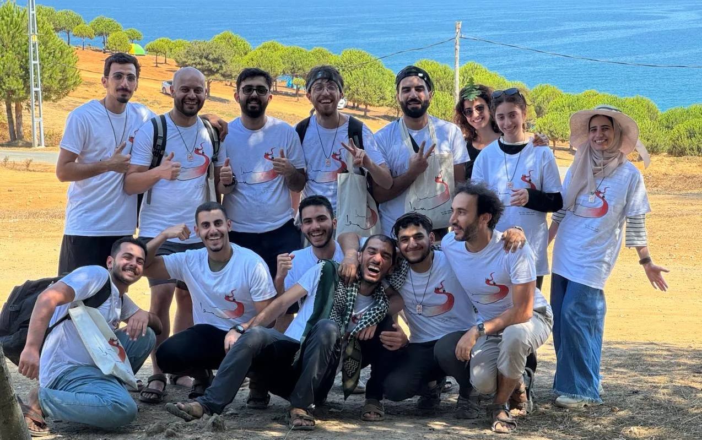
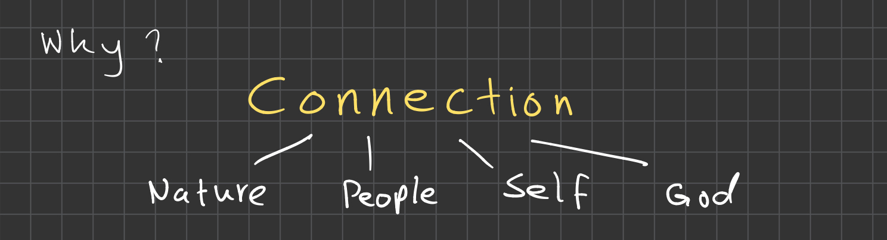
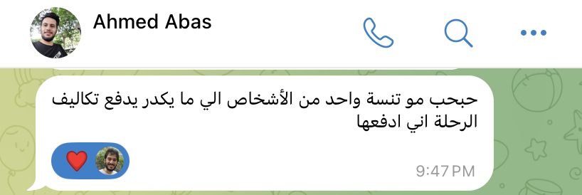
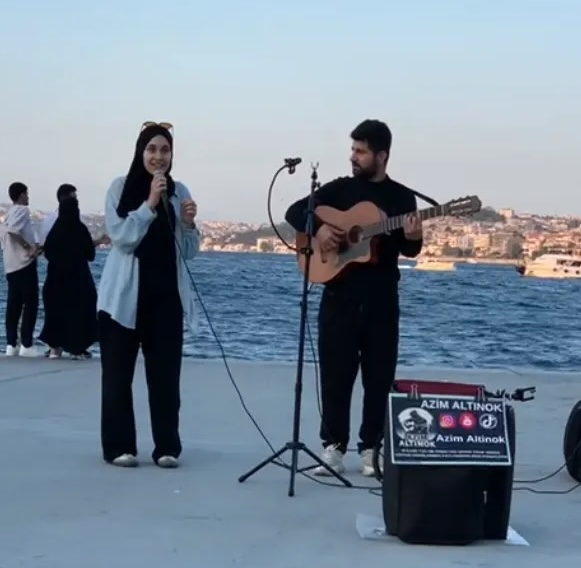

> Every meaningful conversation is made up of countless small choices. There are fleeting moments when the right question, or a vulnerable admission, or an empathetic word can completely change a dialogue. A silent laugh, a barely audible sigh, a friendly smile during a tense moment.
>
> [...]
>
> **The right conversation, at the right moment, can change everything.**

— Charles Duhigg. Supercommunicators: How to Unlock the Secret Language of Connection.

Charles may be speaking of conversations here, but I believe this is true for just about any kind of interaction we have with the world around us. Living a meaningful life, therefore, is to make these small choices with intention. The 29 day challenge trip was our shot at leading an intentional life–to unblock our sensory channels and reconnect with the earth we walk upon, the people we are surrounded by, the nature we are immersed in, and the infinite beauty we carry within.

---
## Why the 29 day challenge trip was created

A few months ago, Murtadha, a few wonderful friends and I put together an impromptu meeting to brainstorm the idea of creating an opportunity for young people from Iraq that would be meaningful and valuable for their lives. We knew we wanted it to involve travel and include activities that would take people out of their comfort zones, offering them chances to try things they'd never conceived of. In other words, we had ideas for the *what* (developing agency; practicing active listening, empathy and compassion; exploring new possibilities and expanding potential) and the *how* (journaling, 1-on-1s, debating, workshops on topics like resilient mindsets and critical thinking), but we struggled with defining the *why*.

After some deliberation, we landed on a word that immediately resonated with all of us. The word is "**Connection**".

And thus the intention of the 29 day challenge trip was defined:

> To help people connect—*with* each other, with nature, with themselves, with God, and with everything.

<figure class="align-center">
  
  <figcaption style="text-align: center;">This is what I wrote in my notebook at the brainstorming meeting to define the <em>why</em> of the Turkey trip.</figcaption>
</figure>

---
## What it took to actually make it happen

> When you want something, all the universe conspires in helping you to achieve it.

— Paulo Coelho. The Alchemist.

To organize this trip, we had to stretch ourselves to the limits in order to do the best job we possibly could. We had to do things we are not good at, like asking for help and building a selection process to pick the top 16 people to invite for the trip. But, we were lucky—we were not alone. Many people came forward and offered help, some without even being asked.

<figure class="align-center">
  
  <figcaption style="text-align: center;">Translation: "bro, don't forget, for one of the people who can't afford to pay the expenses of the trip, I'll pay it for them."</figcaption>
</figure>

This is one example of proactive generosity. I received this message from Ahmed Abas immediately after getting off the livestream for announcing the trip. Ahmed had received a grant to pay all his expenses for the trip two years ago, and this time he funded a grant to cover somebody else's expenses. This is as perfect a pay-it-forward story as it gets, and we got to witness it unfold. Ahmed was joined by nine others who pulled together all they could to donate and make more grants available. All of the donors were past participants who had themselves received partial or full grants.

Another example of giving is people who donated their time. I received several messages from people offering their help. One was someone who had applied to the trip himself but wasn't selected. Yet he readily kept offering his help, and twice went out of his way to solve difficult problems for us. When I sent him the rejection message, I thought he was going to be unhappy with us and our relationship would be forever tainted, yet he did not hesitate one bit to help make it the best trip possible for the people who took seats he had been competing for.

The last type of generosity I'd like to highlight came from strangers.


The street musician who gave the microphone to one of the participants and created an unforgettable experience for her and her peers.




The sweet old lady who maintained the bathrooms at the campsite and became the grandmother of the group.





The guy who gave a high five to one of the trip participants to help him complete a dare to "high five 5 strangers."


And the countless others who gave with kindness.

## What it was really like

Check out the participants' blog posts to learn directly from them what they experienced on the trip:



The mountain from the plain


انت أمام نفسك في كل دقيقة، تراها اينما التفتت، في الحجر والشجر والشمس وعيون البشر.. لا مفر لك من نفسك، البحر العميق يخبرك انك أنت، في الوقت الذي لا تعرف فيه ما أنت..


Some experiences are hard to describe in words, and this trip is definitely one of them.


رحلتي الى تركيا


هذا هو الفريق الشكاكي الي عشت وياهم افضل 10 ايام بالسنة


رحلة الى جوهر الروح


🌿 رحلة إسطنبول: كما يرى المتسلق الجبل من السهل



---

I would like to end with an invitation. If something in this story moved you and you feel called to be part of it, please reach out. There are amazing people from these trips looking for their next opportunities, and sometimes the most unexpected connections lead to the most beautiful outcomes. You might just be the link someone needs.



Send me a message


