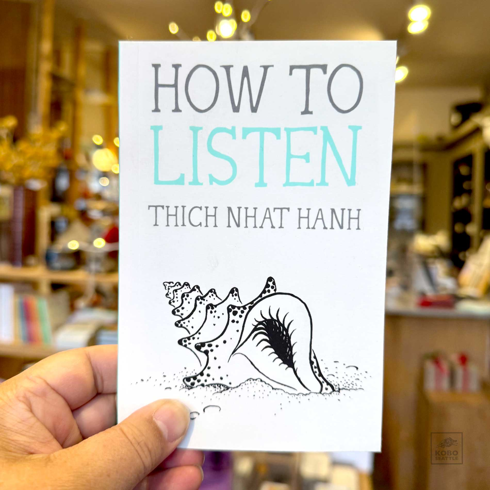

> When we listen to someone, we already have ideas about what is being said. We tend to bring up and compare what we already know with what we are hearing. If the two things are the same, we say, "Oh, that's right." We accept it.
>
> When we compare and we see that what's being said isn't the same as what we've already learned, we say, "Oh, that's wrong; I can't accept that." 
> 
> **And in both cases, we learn nothing.**


> عندما نستمع لشخص، غالباً ما تكون لدينا أفكار مسبقة عمّا يقال. نبدأ بمقارنة ما نسمعه بما نعرفه من قبل. إذا تطابق الكلام مع معرفتنا، نقول: "صحيح، هذا الكلام منطقي." ونقبله بسهولة.
>
> أما إذا كان مختلفًا عما نعرفه، نقول: "لا، هذا خطأ، لا يمكنني قبول ذلك."
>
> **وفي كلتا الحالتين، لا نتعلم شيئًا.**


Everyday, I meet a friend who thinks books are valuable, but boring, and they'd never be able to read one. I wonder if those friends have ever had the company of a *good book*. I wonder if reading this book would change their minds.

**How to Listen** is a tiny book, I carry it inside my large pant pockets. Don't let its small size fool you though; a small seed planted in a fertile soil becomes a massive tree, and so does this book. Each page beams with compassion, kindness, and wisdom. It starts with a quick reminder on the power of listening, what stands in our way to listen to others, as well as to ourselves, and ends with practices we can do to become better listeners.

> When we practice deep listening [...] we can restore harmony in our partnerships, our friendships, our family, our community, our nation, and between nations. It is that powerful.



One of the beauties I saw in this book is how it skillfully connects listening with compassion, mindfulness, suffering, habits, anxiety, happiness, love, and many more. I have read about these topics from the perspectives of psychology, neuroscience, behavioral and social studies, self-help, and while all were valuable, none touched the essence of what makes us human as Thich Nhat Hanh's words.

This book has helped me have some precious and meaningful conversations with dear ones. My mom and I went to a park, she read a few pages out of this book for us, and we reflected on what they meant. I got to learn about two of my mom's childhood friends and how they were examples of compassionate people for her.



Several days later, my mom and I went for a walk and she asked me if it's a good idea to have *"a heart like a river; people may throw twenty or thirty kilos of salt into it, but we will not suffer"*, and once again we had an unforgettable conversation.

I would like to end this post with an invitation. If you are in the same city I am in now, or will be visiting soon, let us go for a walk and listen to each other. However, if an in-person meeting is out of reach for us, let us have a call online. Please reach out to me and tell me if you'd like to accept my invitation.



Send me a message

