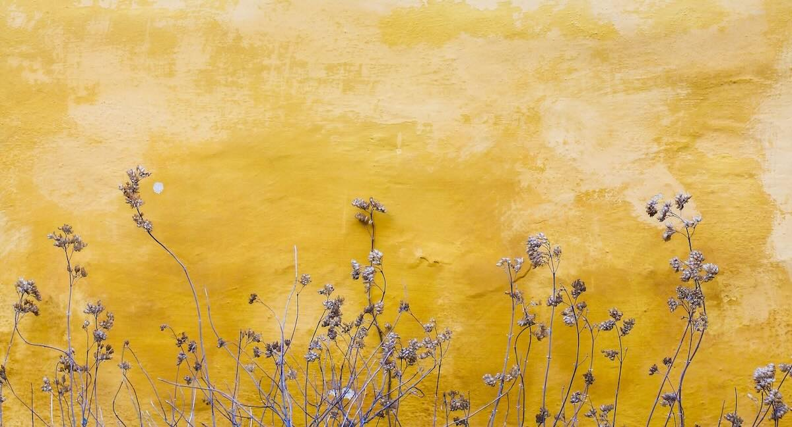

> اني احس كل الناس يحبوني، لانه اني احب كل الناس
>
> I feel loved by everyone, because I love everyone

— Hussein Al-Khafaji

I was a 13-year-old kid in 8th grade. He taught older kids in 11th and 12 grade, but he came to our classroom to fill in for our absent teacher. He taught physics.

He radiated kindness and love that I hadn’t seen before, so much so that his words and his presence have stuck with me to this day, with semi-perfect clarity. He planted a seed inside of me that even 20 years later is still growing.

Now I say this to myself and ask you to be my witness:

> Be like teacher Hussein Al-Khafaji. Love everyone, radiate kindness, and inspire people to open their hearts wide.
