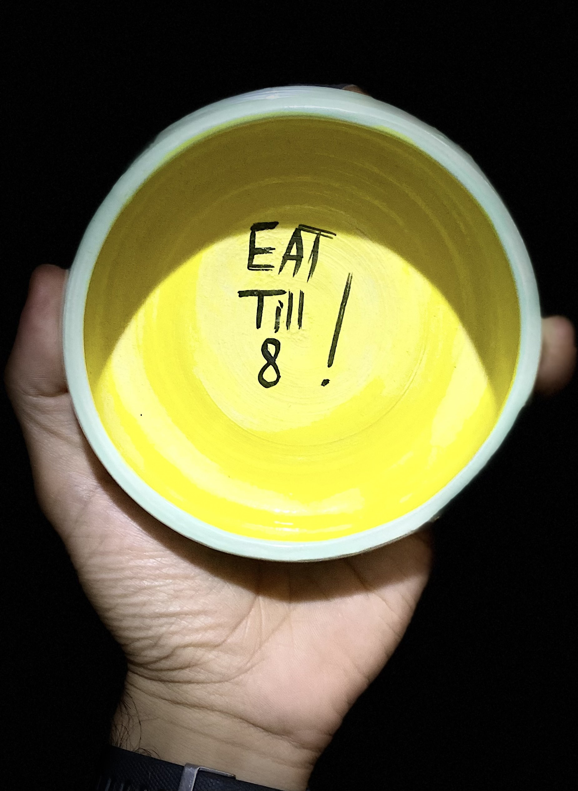

This is the first newsletter issue, so it’ll span 2 weeks instead of 1. Moving forward, I’ll keep a cadence of 1-week, and send it out on Sunday.

This is going to stay as an experiment and will likely undergo lots of changes until I find a consistent format that I can maintain.

## Updates

### @Work

- We started the [learner’s club]() on October 25, 2023!
    - Everybody in the club is excited for the journey we’re starting together.
    - We had a meeting on:
    [The Science of Recharging on Weekends and Vacations | WorkLife with Adam Grant](https://podcasts.apple.com/tr/podcast/worklife-with-adam-grant/id1346314086?i=1000629096574).

        

        We discovered Google Meet’s Halloween effects! 🎃

    - You can view the podcast summary here:

        [Podcast Summary: The Science of Recharging on Weekends and Vacations | WorkLife with Adam Grant](/notes/podcast-summary-how-to-effectively-use-vacations-and-weekends.pdf)

    - In addition to the weekly meetings, we now have an online community with threads!

    

    - We’re making lots of fun changes as we go, it’s invigorating to see how much this will evolve.
- We submitted an application for [Stevens Initiative’s 2024 Virtual Exchange Academy](https://stevensinitiative.smapply.io/prog/application_for_the_2024_virtual_exchange_academy/).
- We started sharing out an [announcement](https://app.clickup.com/9009115670/v/dc/8cfrcgp-520) with a few people to register their clubs with Hub200 and Journey.
- We organized an English Meetup on Apartheid.
- We’ve been learning [Colin Pal’s Business OS](https://colinpal.notion.site/colinpal/Systems-To-Scale-Playbook-9de6a09282d2442a98dbb5457c22a6cb). If you’re running a business, highly recommended for you to check out!

### @Home

- Mina has been committing to a morning routine of knee exercises, yoga, and sometimes meditation. She has only missed a few days since October 23, 2023!
- We’re saying goodbye to Turkey.
    - We’re selling our [Hyundai i10](https://www.sahibinden.com/ilan/vasita-otomobil-hyundai-tasinma-nedeniyle-satiyorumc-kadindan-1131715519/detay) and [Dacia Sandero](https://www.sahibinden.com/ilan/vasita-otomobil-dacia-sahibinden-dusuk-km-acil-satilik-tasinma-nedeniyle-1131710685/detay/).
    - I moved to Baghdad on November 4, 2023 .
    - We had a farewell party on November 3, 2023.
    - Safwa will be staying at our apartment while we’re gone.
    - We’re hunting for a new home in Baghdad. If you have a lead, please share it.
    - Bazooni is staying with Muntadhar Al-Abdali for a week.

    

- Mina biked and I longboarded down to Kadikoy to play ping pong, and we realized that my longboarding in the street makes Mina nervous.
- Mina and I biked to the coast and had a lot of fun! We fixed the battery of our electric bike and sent it to Baghdad so Mina can use it again.
- Marie, Ged, and Jorgan came over to Turkey and we have a wonderful time together. We hiked parts of the Lychian way, cooked dinner on the eternal flames of Mount Chimera, swam and standup paddle boarded in Korsan Koyu, boated over the sunken ruins in Kekova, fueld up on pomegranate juice, and filled up on some of the finest food the Turkish cuisine has to offer.

    

    

- Thanks to Suleiman Ghalib and his parents for sending daily photos/videos of him, our hearts are melting every single day. He’s so cute, we don’t know how to handle it ❤️.

    

- We’ve been watching **[Live to 100: Secrets of the Blue Zones](https://www.netflix.com/title/81214929)** and got inspired by this idea from Okinawa:

    > They have this ingenious little trick. Before a meal, they intone three words, “hara hachi bu”, which literally means “eight out of ten”. But to them, it means “Stop eating when your stomach is 80% full”, and it’s resulting in being satiated without being stuffed.
    >

    

    We, unintentionally, have morphed this into “eat till eight” and have been reminding each other of it before meals. Mina and I even made a ceramic bowl with that inscribed on it.

    

- We finished [It Takes Two](https://www.google.com/search?q=it+takes+two&sourceid=chrome&ie=UTF-8)! It deserves the title of the best video game ever.

    

    We got a good laugh out of seeing the pop up at the end of the game reading “Achievement unlocked. It Took Two”. Simple and punchy.

### @Me

- I’ve been captivated by Elif Shafak’s mastery of language, her wide knowledge of various topics and cultures, and her way of portraying the world through text. I’ve been feeling a great sense of awe as I read her **[10 Minutes 38 Seconds in This Strange World](https://www.goodreads.com/en/book/show/43706466).**
- Last week, I practiced non-attachment to an emotion. Here’s the story:

    As I started counting the costs of our move from Turkey to Iraq and the losses from selling our possessions, I started getting overwhelmed by an anxiety about money. I define being overwhelmed by an emotion as the state in which that emotion becomes the driver in charge of my decisions and actions. Thanks to Mina, Abubakr, and my 1-hour silent contemplation, I was able to find my way back to my values and my intentions and discovered a deep sense of liberation and gratefulness. My [guest house](https://www.scottishpoetrylibrary.org.uk/poem/guest-house/) welcomes all its visitors.

---

That’s all for now. Please [share with me](https://t.me/mujzuh) your feelings and thoughts on this issue.

Sending you love wherever you may be 💌

Mujtaba

ℹ️ **If you’d like to receive future issues of this newsletter, subscribe here**
