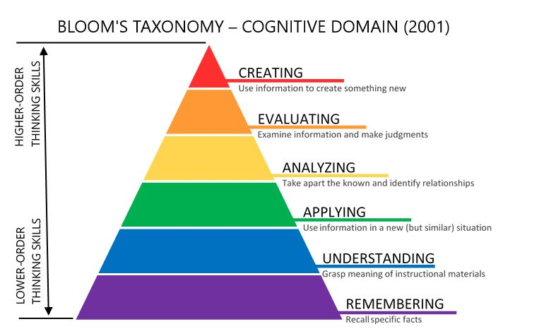

In this issue, I ask for your help on a decision I need to make. Please share your
opinion with me on the question in the [@Me](#help-me-decide) section.

## Updates

### @Community

Murtadha ran a hackathon called HurryApp Hackathon at Hub200.

Simultaneously, Mina has been running her ceramics classes. It's fun to see the
wide difference between the two activities in this video.

And I have been playing a supporting role at both.



I loved being at both events

### @Family

Mina and I went biking by the Martyr Monument in Baghdad. It was beautiful. Mina
created a fun reel about it and will post it soon on her
[personal Instagram](https://www.instagram.com/mina.walaa/).
Subscribe to her if you don't want to miss it.



### @Me

I've been learning about frameworks for learning. My favorite so far is Bloom's Taxonomy.

Bloom’s Taxonomy is a classification of the levels of learning. It's meant to help
educators design learning experiences for the desired learning outcomes.

I've stumbled on this as I'm designing the upcoming Lifelong Learners Club, which
I'm thrilled to announce soon.


#### Help me decide

If I have time and space to offer a 3-6 month long course, what would you suggest I
make it about?

1. Software engineering
1. Meaning and values
1. Something else?

Note that I might bring others more experienced than me to lead the training and
mentoring in the course, so don't let my simple knowledge be a limiting factor.

Your answer will be valuable in helping me think through this. Please share it in the
comments below or by messaging me.


## Quotes

### I. By Sister Chân Không - Learning True Love (Book)

Some background before you read the quote:

1. "Thay" is a Vietnamese word meaning teacher. When sister Chan uses it by
   itself, she's referring to Thich Nhat Hanh.
1. The book _Don’t Forget Those Who Suffer_ is by Thich Nhat Hanh and it was banned
   in Vietnam.

Now you can read the story:

> One day in early September of 1966, I was on my way home from Thay Thong Buu’s
> temple on my motorbike. I had stopped there to pick up 300 copies of _Don’t Forget
> Those Who Suffer_. If I had been driving a car, no one would have paid much
> attention to me. Wealthy people had private cars, and since they were rarely
> communist, the authorities never stopped cars to search for guerrillas. But
> guerrillas did carry grenades on motorbikes, and the police routinely stopped
> motorbikes. When I drove across Truong Minh Giang Bridge, a policeman stopped and
> searched me. He saw the books and suspected they might be communist leaflets. When
> he asked me what they were, I said, “Just some books.” But when he started leafing
> through a copy of _Don’t Forget Those Who Suffer_, I became frightened.
>
> I invoked the name of Avalokitesvara, the bodhisattva of compassion and
> fearlessness, and regained my serenity. I saw that my only motivation was to wake
> people up from forgetfulness and help them realize the suffering of the people in
> the war zone. Even if I were sent to jail, I knew I was doing what was right, and
> I was ready to accept full responsibility. With that thought, a big smile came over
> my face.
>
> The policeman smiled back, and read the first line: “Dear Em, do you know?” “Em” is
> the familiar greeting from an older brother to his younger sister or from a young
> man to his beloved, and it communicates intimacy and kindness. Thay always started
> difficult essays with sweet beginnings. The policeman read the first sentence aloud
> and said, “This is a love story, isn’t it?” I smiled again, and he handed me the
> book and said, “Okay, you can go.” I knew I had barely escaped.
>
> I don’t know why, but I rarely seem to have problems when my heart is pure with the
> intention to help others.

What a powerful story!

To be so grounded, even as she realizes she's about to go to jail, she puts on a big
smile on her face has been stuck with me everyday since I read this and inspiring me
to be present and compassionate.

---

That’s all for now. Please share with me your feelings and thoughts on this week’s issue.

I wish you a week of compassion and fearlessness,

Mujtaba
