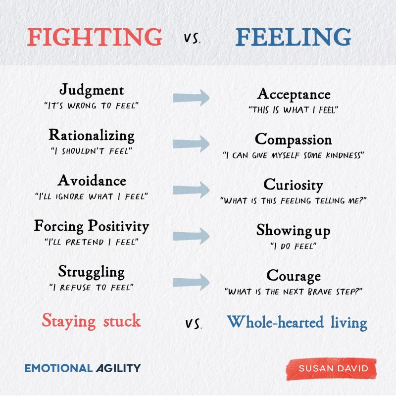

We had a full week between hosting people almost everyday, diving into vast oceans of
knowledge, and launching new projects.

## Updates

### @Community

- This week we felt amplitudes of
  [Baraka](http://www.almirajsuficentre.org.au/qamus/app/single/240)
  (i.e. blessings). Our hearts and our home was illuminated by the beautiful people
  who visited us.  I leave you with 2 short videos to give you a sense of what it was
  like.

  

  
- After 1 year since we submitted our application, we finally received the
  certificate of registration for
  [Journey (الرحلة)](https://www.instagram.com/journey.iq/) as an NGO.
  Lots of people helped us with the registration process, which made it much less
  bumpy than it usually is. Looking forward to seeing what doors this opens up for
  our community.

  

### @Family

- While working on the hackathon last week, Murtadha and I were running low on sleep.
  Our years of camping, sleeping in cars and at airports have taught us to be just
  like cats and sleep anywhere 😎

  

- While previously only giving month-long classes, Mina added more offerings and
  now people can come for a single session if they'd like to give pottery a try. This
  has been making her extra busy, and she's been loving it!

  

### @Me

- The [Lifelong Learners Club]() is now open! Join us if it
  seems interesting to you!

  

  Mina helped me make this Reel to announce it to the Instagram world. She's the reel
  wizard!

- I also announced the event
  [How to Build Websites & Apps without Code with Mustafa Alwan]().
  If it sounds interesting to you, you can join online or in-person!

  

  I'm so excited for this event because the idea for it came from wanting to learn
  from Mustafa Alwan personally, and then deciding to do an event around it so others
  get to learn too.

## Quotes

### I. John Vervaeke on Thinking outside the box

Try to solve this problem. It's called the 9-dot puzzle.



The phrase "think outside the box" comes from this problem.

> Giving [people] the belief that they have to go outside the box does not help them to
> solve this problem.
>
> You shouldn't reduce all of your sense of knowing to believing. What's involved
> here is **not believing** that you have to go outside the box, **it's knowing how**
> to go outside the box.

– Source: [Watch the full YouTube video here](https://youtu.be/54l8_ewcOlY?si=r-aU2t_w6POAUYpU&t=3057)

### II. Susan David on Growth and Expansion

> You can’t rebuild a city when it’s still under bombardment, but only when the
> attacks stop and peace prevails.
>
> The same goes with our internal world: When we stop fighting what is, we can move
> on to efforts that will be more constructive and more rewarding.

– Source: [Read the original post here](https://www.linkedin.com/posts/susanadavidphd_you-cant-rebuild-a-city-when-its-still-activity-6868911833823133696-EU80)

I heard this quote months ago, but I struggled to understand it and I've been
grappling with it to figure out its meaning. In a call with Murtadha a few days ago,
it finally clicked for me and I got two meanings out of it.

If I go into it now, this post will get extra long, so I'll save my reflection to be
discussed in the comments section with you if you first share what it means for you
when you read it.

### III. Compassion

> A true king’s power is his compassion.

– Sarabi (Simba's mom) - The Lion King: [Watch scene here](https://getyarn.io/yarn-clip/acefbf92-61fa-4eb6-b736-7ad0e283ad2a)

Thank you Salar for highlighting this quote for me. I love it!

We watched The Lion King (2019) this week and we loved it. Another line we loved so
much that we repeated twice is:

> While others search for what they can take,
>
> a true king searches for what he can give.

– Mufasa

---

That’s all for now. Please [share with me](https://t.me/mujzuh) your feelings and thoughts on this week’s issue.

Wishing you a week full of meaningful moments,

Mujtaba
