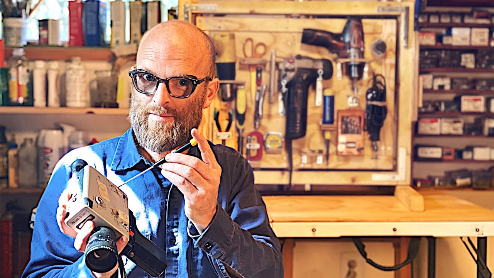
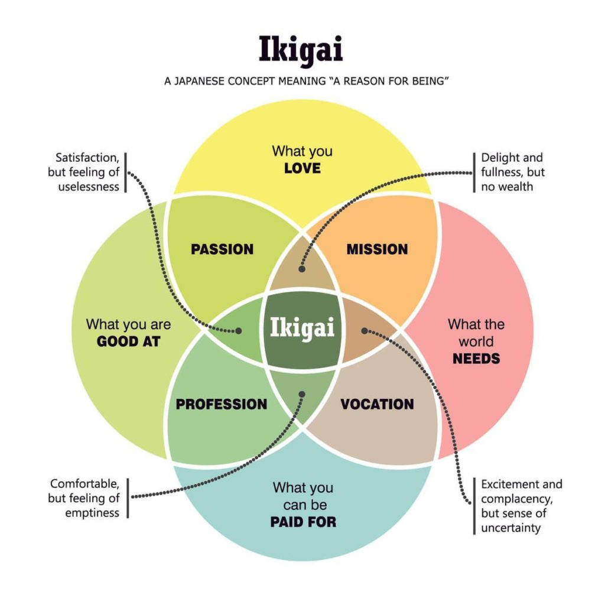
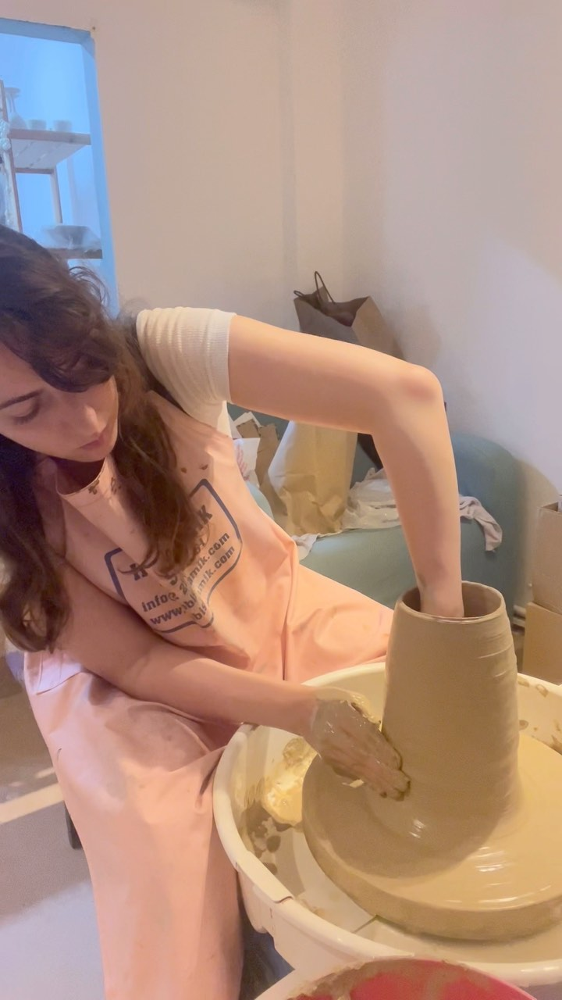
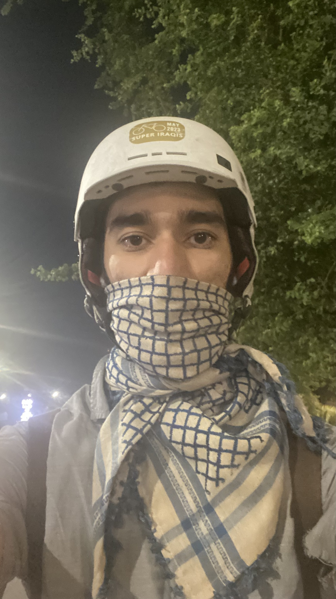

Since this week was my first in Baghdad, the main theme is around settling in and getting a new home established.

## Updates

### @Community

- We started writing a playbook for our beloved organization, Journey. We don’t have much to show for it yet, but this is a foundational element that will unlock lots of cool projects to come. I’m so excited for what will come out of this!
- We had our second call on [The Spirited Man](https://mujz.notion.site/The-Spirited-Man-41da3435b6914a22958f7b5848926306?pvs=74) at the [Learners Club](/p/lll). On the squiggly path we traversed in our meeting, we encountered big topics, such as self-confidence, hobbies, turning passion into a well-paying job, [KK’s 1000 true fans](https://kk.org/thetechnium/1000-true-fans/), Ikigai, quick-fix culture vs sustainable culture, and much more.

    

    “The spirited man is an unlimited series of short films about creation, repair, introspection, thought and books combined with living. The spirited man is an archetype that embodies our favorite part of us, our spirit.”

    - We surmised that success, subjective as it is, might be composed of 4 contributors: luck, consistent work, effectiveness, and growth mindset. The first is completely out of our control, and the rest are areas that we can learn and grow in.

        I’m sure that there’s other elements as well, such as feedback and health, but I think most of these should be components of the four.

    

    Ikigai was a highlight, so I’m placing a visualization of it here. It’s a wonderful idea, and there’s a great book written on it. Highly recommended.

### @Home

- After an intense search of a new home in Baghdad, we finally found one! We have a huge rooftop that we plan to turn into a workshop and a place to host people. We can’t wait to have you over!
- Mina announced a new series of pottery classes, and now you can choose to work on a pottery wheel (my personal favorite). [Sign up here](https://hamdiya.co/en/workshops) if you’d like. Seats are filling rapidly 🔥.

    

    Check out the [full reel on Instagram](https://www.instagram.com/p/CzZO6svqqU2/).

- We received all the boxes we sent from Istanbul, including our folding electric bike! It’s been so nice riding it around Baghdad. In one day, I rode 33km and it took only 1 hour and a half.

    

    In the absence of a proper face mask that keeps out car exhaust and other pollutants, I used this beautiful shemagh. Also, I’m still featuring the Super Iraqis sticker on my helmet :D

### @Me

- The plot thickens in *[10 Minutes 38 Seconds in This Strange World](https://www.goodreads.com/book/show/43706466-10-minutes-38-seconds-in-this-strange-world)***.** The characters of the story are now mature and starting to do things. It seems like they’re about to get themselves in deep trouble, and I’m worried for them XD.
- I created a financial tracking system for my finances using Airtable. Watch the video if you’d like to see what it looks like.

    

    If you’d like to set up a system like it for yourself, I’d like to help you out in exchange for feedback. [Reach out to me](https://t.me/mujzuh).

- After reading [this post on micromanagement](https://www.breathehr.com/en-gb/blog/topic/health-and-wellbeing/8-signs-youre-dealing-with-a-micro-manager-and-how-to-manage-them), I learned, regrettably, that I’ve been guilty of subjecting people I work with to micromanagement. Some of the most glaring signs that point to it include:
    - Long standups. I ask about nitty gritty details making the meetings I join extra long.
    - Overcomplicating tasks. I have a clear vision in my head for high quality work, but it comes out quite complex when I communicate it.
    - Requiring my sign off for approval. Too often I block my coworkers from moving forward without my review.

    All this I’m sure played a big role in stifling the enthusiasm and energy of the people I work with, and for this, I’m deeply regretful. If you’re one of the people I’ve done this to, I’m sorry. Please [tell me](https://t.me/mujzuh) what I can do to redeem these mistakes of the past.

    ---

    Friends, have you caught any other behavior in me that I could work on? I could really use your help seeing my blind spots. [Shoot me a message](https://t.me/mujzuh) please.

## Quotes

> In everyday life, it’s better to be valued than needed.
Being needed creates dependency in others and obligation for you. You feel worried and guilty about letting them down.
Being valued grants autonomy. Your help is appreciated but not expected on their road to self-reliance.
>

— Adam Grant ([Source](https://twitter.com/AdamMGrant/status/1707031059957735919))

> Write for your fans and not for your critics.
>

— Brené Brown ([Source: this line starts at timestamp 18:08](https://beingboss.club/podcast/podcast-episode-42-brene-brown-being-boss))

> Clear is kind.
>

— Brené Brown ([Source](https://brenebrown.com/articles/2018/10/15/clear-is-kind-unclear-is-unkind/)) [Thank you Omar Ali for reminding me of this great gem]

## Help Needed

Now that we have a home, we could use help setting it up.

- If you know someone getting rid of stuff and furniture, whether for free or for money, please hook us up. We love giving unwanted or dying objects a new life.
- If you enjoy working on setting up a home with close friends, please lend us a hand as we clean the new place and transport the furniture.

---

That’s all for now. Please [share with me](https://t.me/mujzuh) your feelings and thoughts on this week’s issue.

Wrapping this letter with lots of earnest love 💌

Mujtaba
