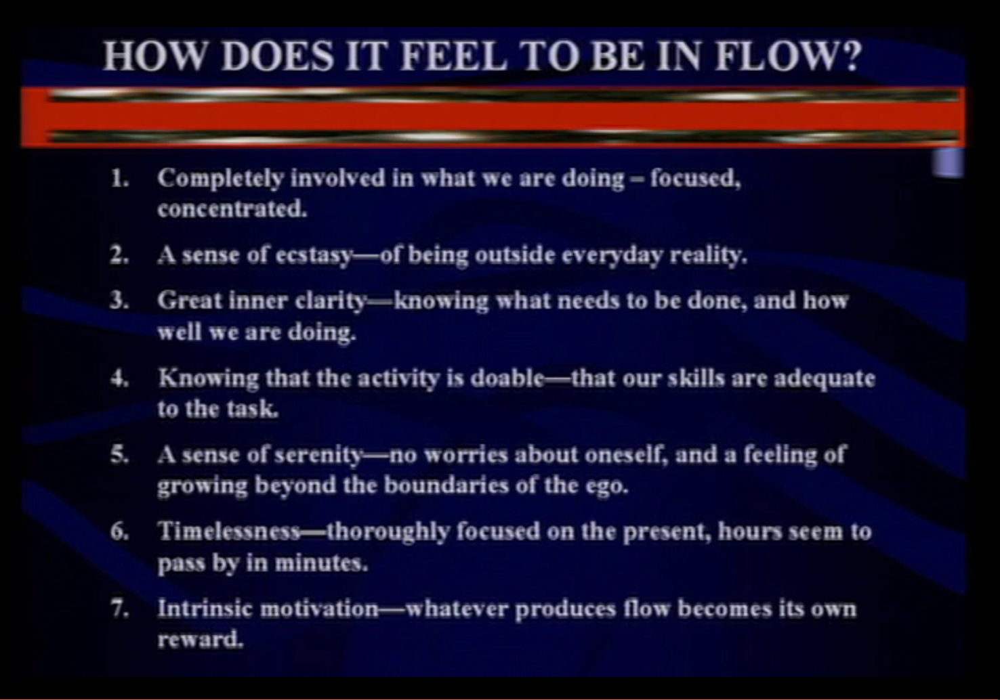
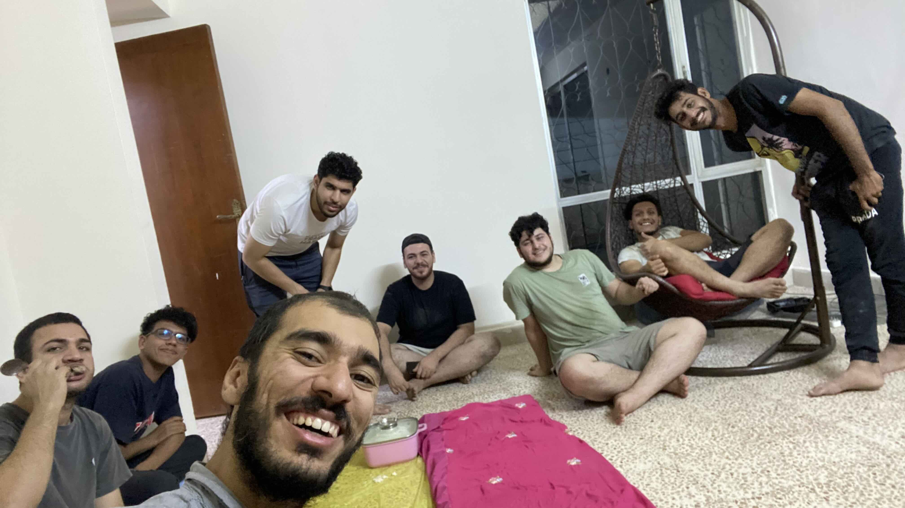
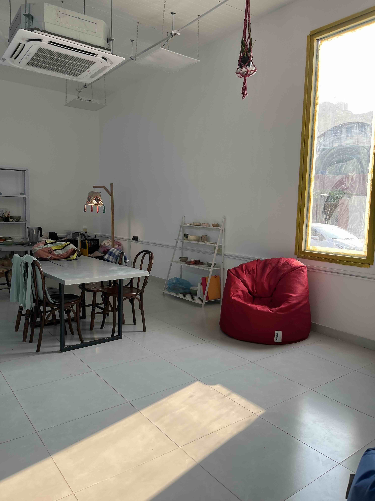

The main theme from last week was setting up our new home in Baghdad and reconnecting with good friends.

## Updates

### @Community

- I’m working with 2 lovely high schoolers, Bilal and Maryam, to start a book club for young people in Baghdad.
- We had our third meeting on [flow state](https://mujz.notion.site/Flow-with-Steven-Kotler-77921979a4e949ffabcfdc94ffa68a0a?pvs=21) at the [life-long learner’s club](/p/lll). I learned what it feels like to be in flow and the conditions for flow.
Now I’m spending my learning time to redesign my environment and my mindset to be fertile grounds for getting into flow everyday.

    

### @Family

- We’ve been getting lots of help from the habibis to set up our apartment!

    

    Big thanks to everyone who has helped on this project. There are several others who helped and are not included in this photo.

- Here’s a tour of our new house! Pardon the mess, we’re still sorting it out.

    

- I was dusting the closet in the bedroom and finding tiny remnants of the people preceding us, such as pencil markings of a kid’s school grades, forgotten fingernail clippings, dead skin cells mixed up with the dust, and several nameless odors. This took me on a journey of wonderment; imagining what their lives were like.

    I saw visions of their kid putting his books in the closet when he had no use for them, then taking them back out to put in his backpack before going to school. Another vision came to me of one of the parents sorting the clothes in the closet after having done the laundry, oblivious to the breadcrumbs from their lives they were depositing. This connected me with those people and made them a part of me, as well as connected me with my life back when I was a kid with parents in living in the same home.

    The inaudible voice in my head said to them “Sawabona”, the South African greeting translating into “I see you”.

- Mina’s studio in Baghdad is looking snazzy!

    

    She added the window, painted the walls, brought the chairs all the way from Istanbul, her mom made the lamp in the back, and her friends gave their sweat and love.

### @Me

- Being in Baghdad with a home of our own feels very different from being in Baghdad as a visitor staying with family or friends.

    As a visitor, I start the trip full of energy, then I spend each night counting the time remaining and whom I still would like to meet with, and I end the trip feeling drained.

    As a resident, I see the long view of time and feel belonging with the community of Baghdadis. Everybody is my neighbor and we’re taking our time to slowly grow our relationships.

    Each night feels restorative, not anxious. Each day feels like a gift to soak in, not a an elusive moment that slips by quickly.

- I’ve always been bothered by the cumbersome steps it takes to open a new phone number in WhatsApp.

    Therefore, I built an Apple Shortcut that opens up WhatsApp with any phone number you copy, without having to store the phone number as a contact.

    [Get it here](https://www.icloud.com/shortcuts/6266c56055bc4f4eabb873b92eca470e), and if you use it often, you can [add it to the home screen](https://support.apple.com/guide/shortcuts/add-a-shortcut-to-the-home-screen-apd735880972/ios). If you try it, please [send me feedback](https://t.me/mujzuh).

    [A video demoing the shortcut](https://prod-files-secure.s3.us-west-2.amazonaws.com/c2faa6f0-b1c9-431a-a8ac-dc61b3577414/91d944b4-99c8-420d-af61-4d1261bd712f/apple-shortcut-open-with-whatsapp.mp4)

    A video demoing the shortcut

- I’m quite impressed by the development of internet in Iraq.

    Fiber optic internet seems to be available everywhere now, and it’s blazing fast! At Mina’s family, I got speeds of 100 Mbps! At our home, I’ve seen it go up to 40 Mbps, but right now it’s 19, which is still pretty great!

    

- I’ve been catching up with the community of tech and entrepreneurship by joining a friend’s marriage celebration at a beautiful farm, a conference on Global Entrepreneurship Week, and a graduation ceremony by She Codes Too. I’m impressed by the great work all of those crews have been putting for the betterment of life here in Baghdad.

## Quotes

> Show me your calendar, and I will tell you your priorities. Tell me who your friends are and I’ll tell you where you’re going.
>

— Kevin Kelly ([Source](https://twitter.com/kevin2kelly/status/1709297591681261775))

> You can’t rebuild a city when it’s still under bombardment, but only when the attacks stop and peace prevails.
The same goes with our internal world: When we stop fighting what is, we can move on to efforts that will be more constructive and more rewarding.
>

— Susan David ([Source](https://www.linkedin.com/posts/susanadavidphd_you-cant-rebuild-a-city-when-its-still-activity-6868911833823133696-EU80?utm_source=share&utm_medium=member_desktop), which has an insightful illustration)

---

That’s all for now. Please [share with me](https://t.me/mujzuh) your feelings and thoughts on this issue.

Forwarding you all the warm hugs I’ve been receiving from loving friends here in Baghdad 🤗

Mujtaba
