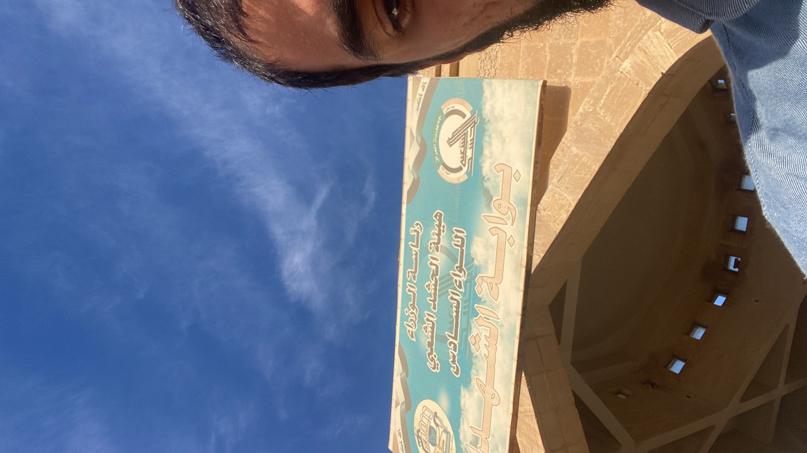
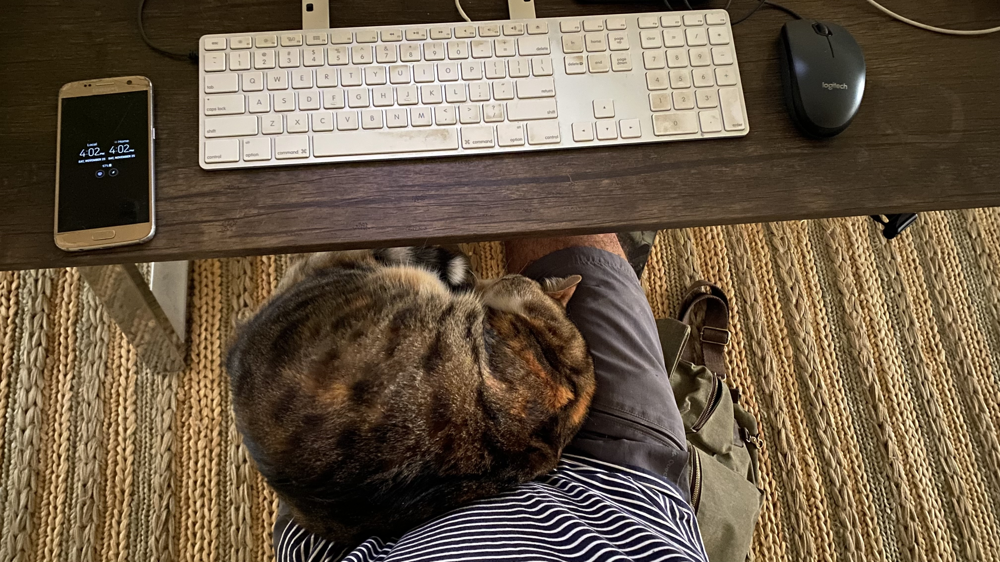
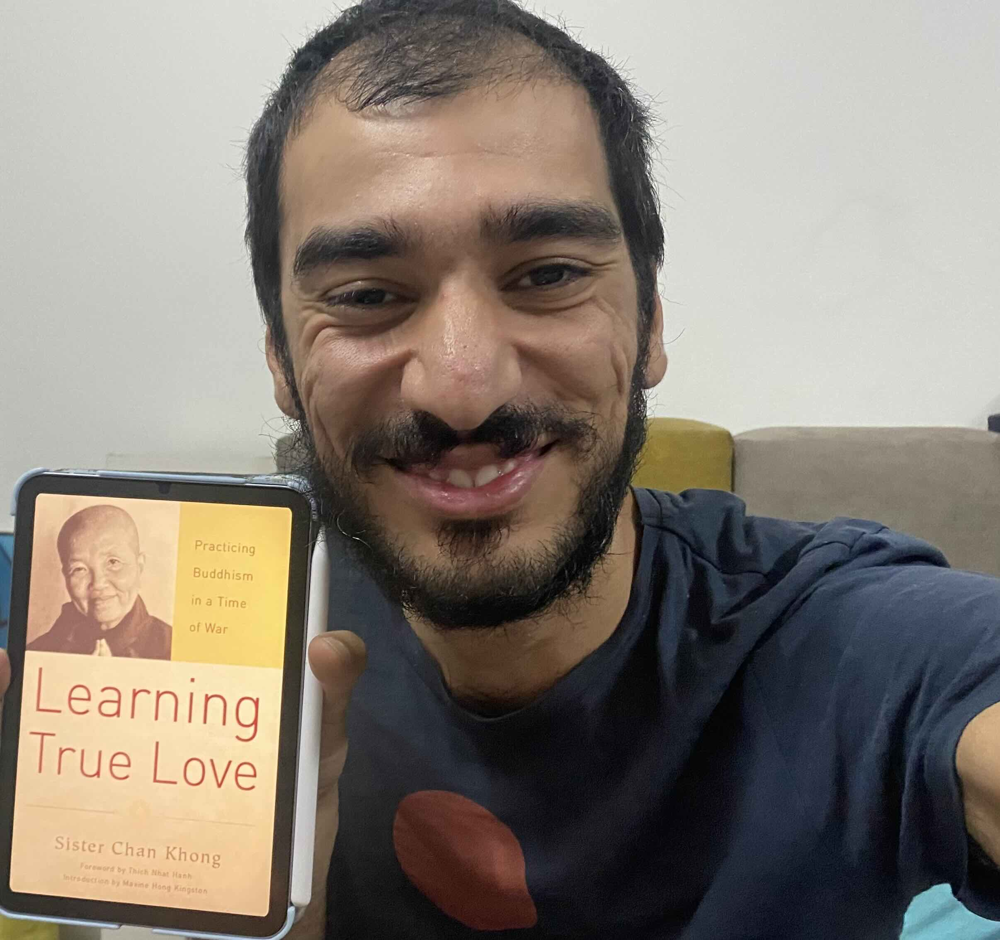

The main theme from last week was untangling a legal mess that my friend got into jail for due to having a name matching that of an ISIS member.

## Updates

### @Community

- I did not partake in any community engagements this week, due to being preoccupied with my new interim job as my friend’s lawyer.

### @Family

- Mina got her kiln working! We’ll get the first batch of fired ceramics next week. Stay tuned.
- Murtadha and Mayce are coming to Baghdad soon!
- Mina is going back to Istanbul for a visit to take her ceramics certification exam.
- Bazooni has been slowly sniffing her way around our rooftop, and is now roaming it more freely.

### @Me

- I went to Tikrit last Thursday; a city that I get apprehensive just thinking about, let alone visit, due to it being the home city of Saddam Hussein. Since then however, the city has taken many different roles and the people there are some of the most generous and sweetest I’ve met in the whole world.

    Even more terrifying, I went there to get into a huge compound of what used to be Saddam Hussein’s palaces; a place that has been bombed over the years of various wars it has seen, until it took its present-day role of a military base for the Iraqi forces.

    

    I snapped this shot sneakingly and sent it to Mina so she can track me down in case I got stuck in there for some reason.

    Being there gives an eerie feeling of the times the place went through, from presidential highness, to a place of demolition, death, and imprisonment. That place is a living example of how times can change the most glorified to be degraded.

    I entered one of the jails there to meet with a friend who has been held for the last 3 weeks for having a name matching that of an ISIS member.

    While I knew my visit there was going to be short, I felt like any moment the place would cling to me and I would never leave. I saw on the security cameras the unfortunate people inhabiting the place and got a foggy glimpse of their conditions, such as being taken out into the yard only once a month to receive some sun, or the visitation policy of once every two weeks alternating between male and female visitors.

    I left that place having a renewed appreciation of freedom.

- On the way back from Tikrit I was contemplating how “I” can be in multiple places at the same time. A part of me—the body—is sitting in a car driving over 100 km/h, while my consciousness was in a very special place with my favorite author, John Green, listening to him talk about the way he sees the world.

While we often focus on the tangible aspects of location in our plans, the ethereal space I occupied was equally vivid. In the backseat of the car, I felt a sense of profound existence in this abstract, yet undeniably real, dimension.

It made me understand that I am not in Iraq the same way as the person sitting next to me was. This is a comforting thought; giving me hope in keeping my connection with my friends, family, and the people I admire in Turkey, Canada, France, the UAE, the UK, and elsewhere.
- Bazooni finally slept in my lap \o/ \o/ \o/

    

    This has never happened in the 3 years we’ve had Bazooni 😸

- I started reading two books:
    - [The Anthropocene Reviewed by John Green](https://www.goodreads.com/book/show/55145261)
    I’ve been wanting to read this book ever since I knew that it was John Green’s first non-fiction work. Watch this animation as he reads the introduction:

        

        I loved he stop-motion animation. Wouldn’t all books be so much richer if they were delivered in this format?

    - [Learning True Love: Practicing Buddhism in a Time of War by Chan Khong](https://www.goodreads.com/book/show/21087167)
    My friend Bilal Ghalib read this book and recommended it to me. Now he’s re-reading it and I started to read it too so we can discuss it together.
    Wanna join us? [Message me](https://t.me/mujzuh)!

        

## Quotes

> The ones who cause suffering must also become the objects of your love. They are the product of an unstable society, and they need our help.
>

— Thich Nhat Hanh ([Source](https://www.goodreads.com/book/show/73744817))

> For anyone trying to discern what to do with their life: Pay attention to what you pay attention to. That’s pretty much all the info u need.
>

— Amy Krouse Rosenthal ([Source](https://www.goodreads.com/book/show/55145261): I read this in John Green’s The Anthropocene Reviewed, therefore the source link points to the book)

> Build a business that puts its people first. Work with partners who share your same progressive and inclusive values. Focus on delivering a great customer experience, and success will come. Make business a force for good. Stay positive; attitude is everything.
>

— Richard Branson ([Source](https://www.virgin.com/branson-family/richard-branson-blog/dear-virgin-america#:~:text=build%20a%20business%20that%20puts%20its%20people%20first.%20work%20with%20partners%20who%20share%20your%20same%20progressive%20and%20inclusive%20values.%20focus%20on%20delivering%20a%20great%20customer%20experience%2C%20and%20success%20will%20come.%20make%20business%20a%20force%20for%20good.%20stay%20positive%3B%20attitude%20is%20everything.): he wrote this in an open letter to Virgin America’s employees, an airline company he founded, after Alaska Airlines decided to shut down VIrgin America, which it had acquired by that point)

---

That’s all for now. Please [share with me](https://t.me/mujzuh) your feelings and thoughts on this issue.

Wishing you eternal freedom and the perception to appreciate it 🤗

Mujtaba
