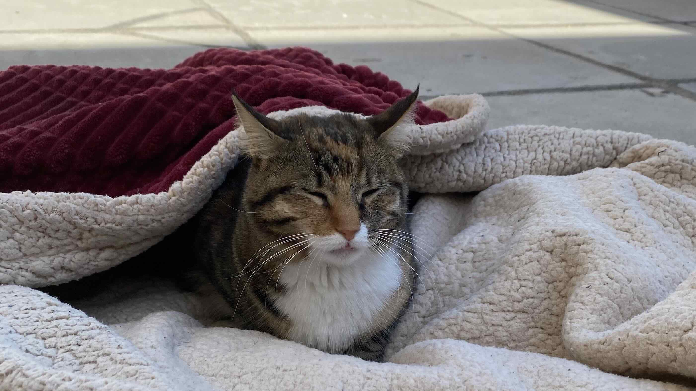
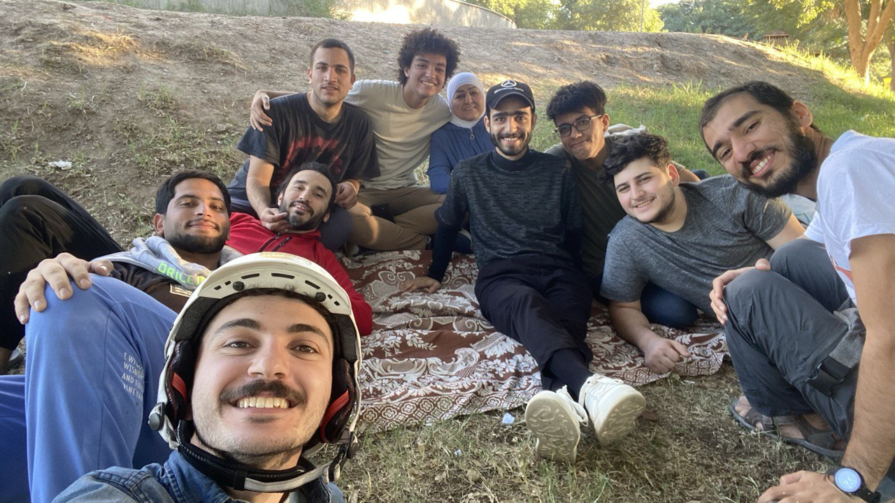

Bazooni got sick this Monday, taking all my attention away from publishing the newsletter to caring for her. It’s been heart-wrenching seeing her like this.

I’ve been wrapping her in blankets to keep her warm

---

The main theme from last week was renovating the Safe House, so it can welcome its first guests; Murtadha and Mayce.

## Updates

### @Community

- We built a table top out of wood that we saved from going to the trash! We’ve been using it everyday.

    

    It was a lot of fun building this!

- I had a beautiful day Saturday with the habibis crew at Al-Zawraa park in Baghdad.

    

    We played 🏸 badminton, 🏀 basketball, 🛹 long boarding,  and had a delicious potluck.

- We announced the book club! Please share it with your youngster friends in Baghdad.

    

### @Family

- We’re opening a new house in Baghdad that we’re calling “The Safe House”. It’s a place that any habibi coming to Baghdad can call home for the duration of their stay.

    

    It looked quite hideous at the beginning. Now it’s much nicer. You’ll see the new shots in the upcoming newsletter issue.

    Initially, Murtadha and Mayce will be using it for a couple of weeks, then it’ll be open for others. If you visit Baghdad, feel free to stay there.

- Mina fired the first batch of ceramics in her new kiln successfully 💯. We’re putting in a new batch tomorrow.
- Mina passed her exam in Istanbul and now she’s a certified ceramist, issued by the Turkish government. This is an achievement that took more than a year. I’m so proud of her.
- Murtadha fractured his foot as he was stepping off a high sidewalk carrying a heavy e-bike.

    

    Ouch, that looks painful.

    He should be OK within 10 days or so.

### @Me

- Inspired by Nayyirah Waheed’s quote, which you can read below, I wrote this poem:

    > Embrace feelings,
	>
    > Whatever they may be.
	>
    > Don't resist, ignore, or deny.
	>
	> ---
	>
    > When embarking on something new,
	>
    > Doubt, fear, and worry will visit you.
	>
    > Greet them with compassion.
	>
	> ---
	>
    > Feelings have a transitory nature.
	>
    > There's room for concerns,
	>
    > While also moving ahead at the same time.
	>
	> ---
	>
    > **You've done this before.**

    I acknowledge that my attempt at writing a poem did not result in literary art, and for that I apologize.

    This all came to me from a meditation session with DownDog. The meditation instructor spoke about how to deal with feelings of doubt when embarking on something new. After the session, I felt inspired to write what I learned in the style you saw above.

    This is the first time I write in that style. What do you think?

- I built a new Telegram Bot to help me keep track of my spending in Iraq. I simply write to it the amount, a title of the transaction, an optional note, and the currency and it saves that transaction into the Airtable I shared in [Nov 13th’s issue]().

    

    I should probably stick to writing code instead of poetry 🙈

    Feel free to reach out to me if you’d like me to set this up for you. I’d be happy to do it in exchange for feedback.

## Quotes

> Happiness is not something that happens. It is not the result of good fortune or random chance. It is not something that money can buy or power command. It does not depend on outside events, but, rather, on how we interpret them. Happiness, in fact, is a condition that must be prepared for, cultivated, and defended privately by each person. People who learn to control inner experience will be able to determine the quality of their lives, which is as close as any of us can come to being happy.
>

— Mihaly Csikszentmihalyi ([Source](https://www.goodreads.com/book/show/66354))

> Sell your cleverness and buy bewilderment.
>

— Rumi

> When creating, be kind to your doubt.
>
> Hear it out.
>
> Thank it for its concern.
>
> And reassure it that you are an artist,
>
> and risk is essential.
>

— Nayyirah Waheed

---

That’s all for now. Please [share with me](https://t.me/mujzuh) your feelings and thoughts on this week’s issue.

Forwarding you all I can from the real love that’s been passed on to me.

Mujtaba
