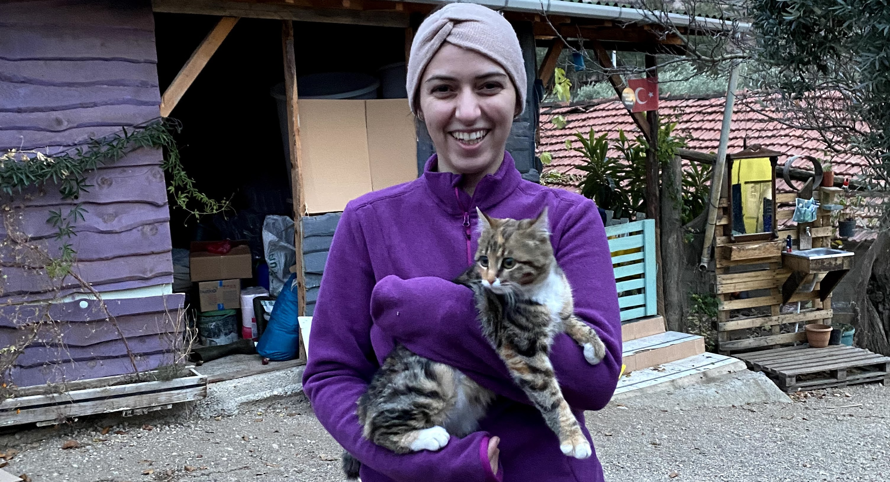
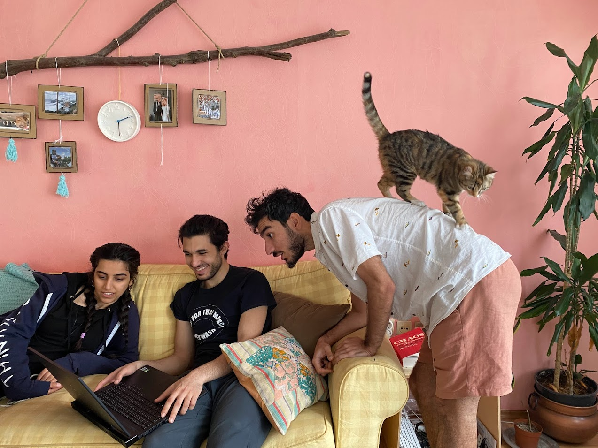
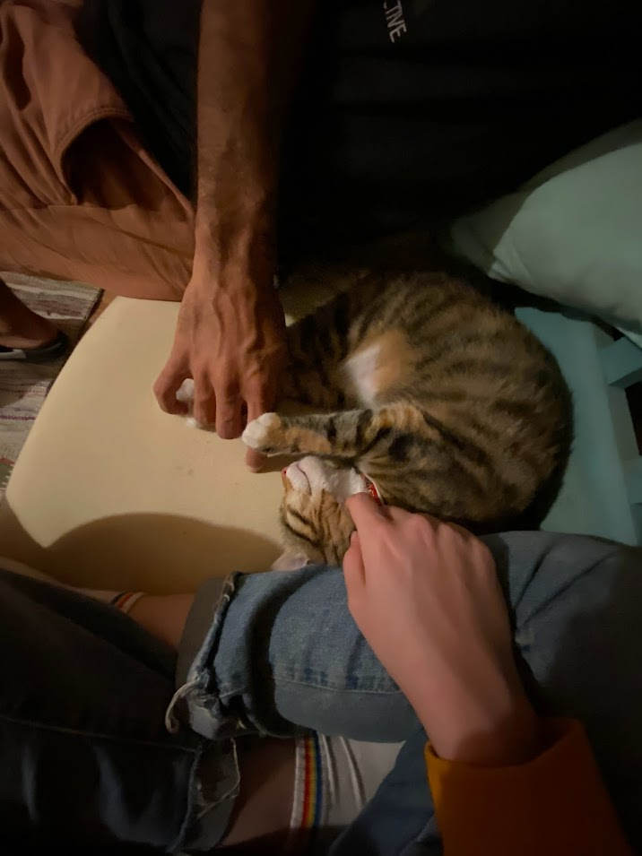
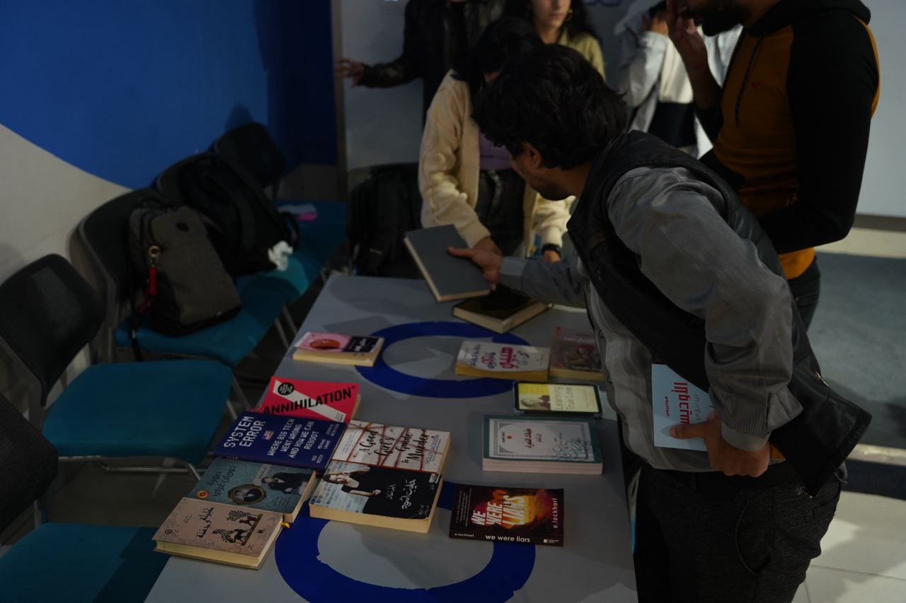
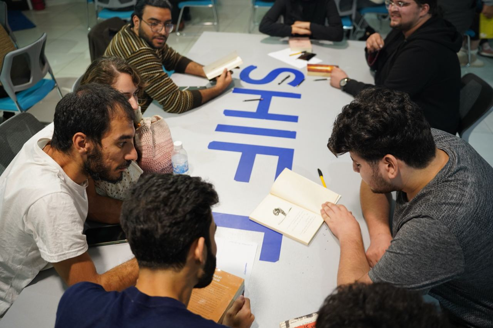

Last Tuesday morning, at around 7am, Bazooni died after catching an illness, which we failed to identify, and enduring it for one and half day. Bazooni was our playful, adorable, and loving cat. She lived for three and half years, from which we got to be part of the last three.

Bazooni brought out a new kind of love within us that we did not know we had. She gave us many laughs with her intricate poses, her sudden sprints, and her love for chirping at birds out of the window. She taught us to be responsible, disciplined, and what it means to take care of a dependent. Through her death, she took us on a journey through a new kind of loss and grief, which is expanding our hearts and opening our eyes to the fragile nature of life.

Just like the sun emanating visible light for our eyes to see, she was a source of joy for our hearts to feel. Her rays reached everywhere, through the smallest holes, under the lowest sofas, and above the highest shelves. Her death came as a dark cloud, hiding her and leaving us in the shade with a memory of the energy she once radiated.

She made us more of a family, and our residence more of a home. I am forever grateful for the soul and body of whom we called Bazooni.

---

You can find more of Bazooni’s photos in the Google Photos album below. If you have any photos of her, please add them to the album.

[You've been invited to "Bazooni"](https://photos.app.goo.gl/utTfeGM2dLy5CWvS8)

# Updates

### @Community

- The high-schooler friends I’ve been helping create a book club ran their first meeting this week. It was full of energy and excitement. It was a lot more fun than we thought a book club would be.
I learned that Paulo Coelho, most known for writing *The Alchemist*, wrote an autobiography titled *Hippie*, **portraying the story of his trips with hippies. I look forward to reading this book some day.

    

    Everybody put the book they brought on one table and we got to choose each other’s books to read.

    

    In our group, we read the introduction of *The Little Prince*

- We had another cleaning campaign with @clean.iraq. It’s always surprising to see the large number of people joining these campaigns and how people don’t mind breaking their backs or cutting their hands to pick up every piece of trash they see.

    

### @Family

- Saif, Abubakr, Murtadha, and Mayce have been blessing us with their stay. They have been very supportive through Bazooni’s death. All of us together buried Bazooni and planted a tree at her grave.
We are grateful to have them as family and friends.
- Through Bazooni’s loss, Mina and I have been sticking together. We shed countless tears in each others arms, we go through our memories with Bazooni, we talk about Bazooni’s visits in our dreams, and give our gratitude for Bazooni and every contributor to her life.

    We are thankful for the gift of Bazooni’s life, as well as her loss. The former filled us with joy, the latter filled us with grief. Both are wonderful.

# Quotes

## **I.**

[Source](https://www.goodreads.com/book/show/6642715-the-forty-rules-of-love)

These days my mind has been bringing into contemplation Shams of Tabriz’s saying in Elif Shafak’s *Forty Rules of Love* (source):

> Whatever happens in your life, no matter how troubling things might seem, do not enter the neighborhood of despair. Even when all doors remain closed, God will open up a new path only for you. Be thankful! It is easy to be thankful when all is well. A Sufi is thankful not only for what he has been given but also for all that he has been denied.
>

## **II.**

[Source](https://onbeing.org/programs/nick-cave-loss-yearning-transcendence/)

In a podcast episode titled ***Loss, Yearning, Transcendence*** Christa Tippet, the host of the podcast [On Being](https://onbeing.org), interviews songwriter and singer Nick Cave, who is best known for the song [*Into My Arms*](https://www.youtube.com/watch?v=LnHoqHscTKE). Nick lost 2 sons, shaping his life to have a core component of loss and grief. It’s a powerful episode that I was able to connect with from the first few minutes.

Here are 3 quotes that resonated with me from that episode:

### II.a.

> It feels to me that loss is our universal state as human beings. I disagree with the sort of “grief club” and the club no one wants to join. I think humanity itself is that club and that we are all feeling these senses of loss, whether it’s directly personal, it’s bred into us, that sense of yearning. And that’s not a failure. It’s a condition. […] This is the common binding condition of what it is to be.
>
>
> And in that respect, I don’t think the common thread that runs through humanity is greed or power or these sorts of notions. It is this binding agent of loss. That, to me, is the thing that makes me able to look at anybody and feel connected to them, regardless of who they are. And I think there’s a power in that that isn’t really recognized.
>

### II.b.

> I think that there was a sort of zeal attached to grief, of seeing the world in a completely different way. I don’t see the world in the same way as I did before. It’s much more complex than I thought and much more fragile. And this creates a different feeling towards people in general.
>

### II.c.

> Grief and empathy are very much connected, in the same way as loss and love are very much connected, too. And that the common energy running through life is loss, but you can translate that into love too, quite easily. They’re very, very much connected. And that comes around from an understanding of just how fragile and vulnerable and precarious the nature of life seems to be.
>

## III.

[Source](https://www.goodreads.com/book/show/55145261-the-anthropocene-reviewed)

In the introduction of his book *The Anthropocene Reviewed*, John Green writes:

> At the end of his life, the great picture book author and illustrator Maurice Sendak said on the NPR show Fresh Air, "I cry a lot because I miss people. I cry a lot because they die, and I can't stop them. They leave me, and I love them more."
>
>
> He said, "I'm finding out as I'm aging that I'm in love with the world."
>
> It has taken me all my life up to now to fall in love with the world, but I've started to feel it the last couple of years. To fall in love with the world isn't to ignore or overlook suffering, both human and otherwise. For me anyway, to fall in love with the world is to look up at the night sky and feel your mind swim before the beauty and the distance of the stars. It is to hold your children while they cry, to watch as the sycamore trees leaf out in June. When my breastbone starts to hurt, and my throat tightens, and tears well in my eyes, I want to look away from feeling. I want to deflect with irony, or anything else that will keep me from feeling directly. We all know how loving ends. But I want to fall in love with the world anyway, to let it crack me open. I want to feel what there is to feel while I am here.
>
> Sendak ended that interview with the last words he ever said in public: "Live your life. Live your life. Live your life."
>
> Here is my attempt to do so.
>

---

That’s all for now. Please [share with me](https://t.me/mujzuh) your feelings and thoughts on this week’s issue.

I love you. You and I are one, sharing a common thread of loss and love.

Mujtaba
