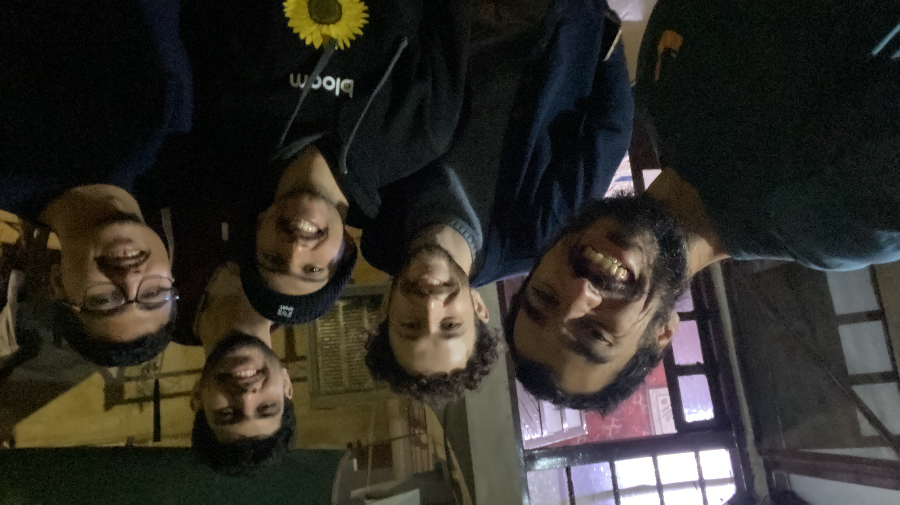
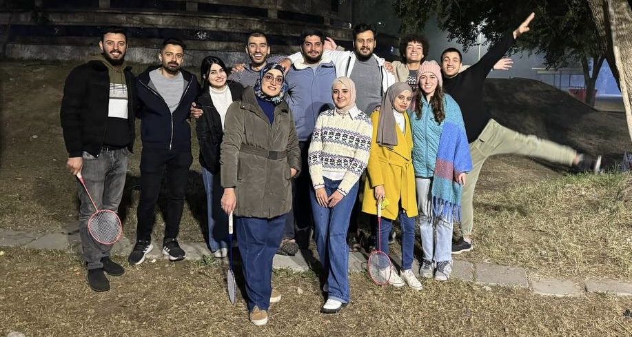
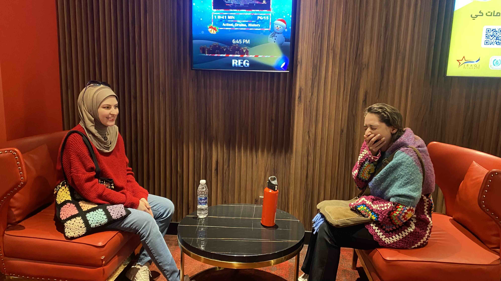
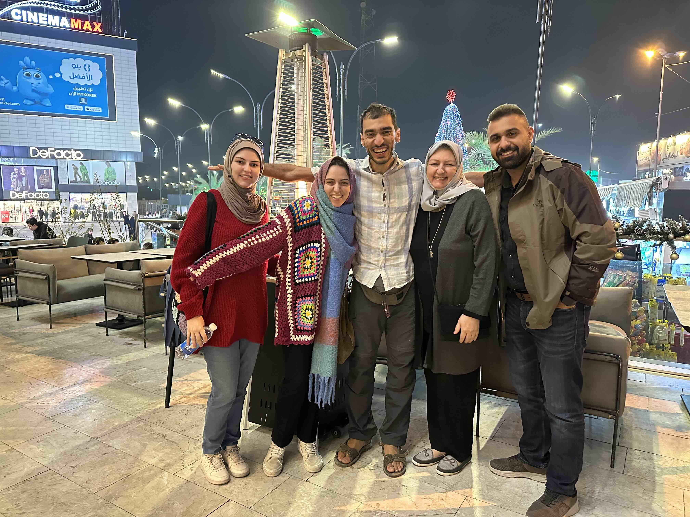
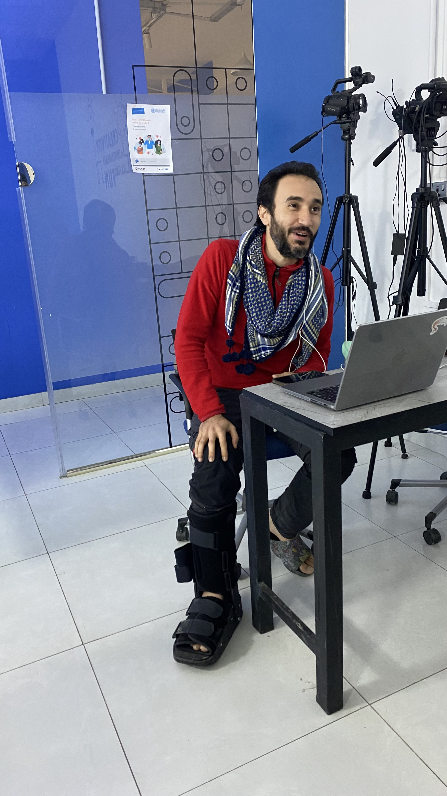

The theme of the last week and a half is working on house projects. It’s been a lot of fun building furniture with wood and bricks. I made this video to show you what we’ve been building.



## Updates

### @Community

- Motaz is free! 🥳

    

    Abubakr, Muntadhar, and I visited Motaz in Mosul the day of his release from jail.

- The participants of the last 29 day challenge trip came together and we had a lovely reunion at the park.

    

    In a world where people care most about expanding impact and breaking records of the number of people reached, it sure is meaningful and heartwarming to nurture with existing community members and friends. Maybe organizations should share the number of lasting relationships they keep alongside the number of people reached.

    Whether it’s with community members, customers, or friends, how do you balance allocating your time for new vs old relationships?

### @Family

- We watched the animated movie Migration with Mina’s family. Loved it! Highly recommended.

    

    Finally! Mina did not fall asleep during the movie! She saved her yawns for after.

    

    I tried hard to convince others to get into flight position and spread their wings with me, but they were all too cold, except for Mina the brave (or the overdressed).

- Murtadha switched out his foot cast for a boot. Now he can stand on two feet.

    

    Yay! Looks less in pain than the last time.

- I had a lovely call with Jaafar. He is now doing a diving job in a remote location in northern British Columbia that is only reachable by water.

    

    Captured right off the boat Jaafar’s working from.

- My mom sent me a voice message complaining about how long I’ve been taking to get back to her messages and asking me to do a better job staying connected. At first I got defensive and gave her a long list of excuses of how I’ve been busy doing work that couldn’t be delayed, and how she shouldn’t take my poor online communication to mean she’s unimportant to me, because I prioritize based on urgency and not importance. Of course I miss my mom dearly everyday and wish I could connect with her more often. I’m doing the best I can with the limited time I’ve got.

    Then I realized that this was my ego talking. I took it personally by receiving her message as an attack on me. Instead of defending myself, I needed to listen to her and acknowledge what’s true; that she was trying to reach me, I was unavailable, and that is painful. I should’ve been hurt with her, not from her. Thankfully I had reached this realization and made amends before our call ended.

    I am deeply grateful for my mom, I still miss her everyday, and this newsletter is an attempt to stay connected with her and all the people dear to me whom I continue to hurt by being a bad correspondent.

    Thank you for putting up with me.

    I miss you and I love you.

## Quotes

### I.

A few days ago, I woke up remembering the following story from Mihaly Csikszentmihalyi’s book *Flow: The Psychology of Optimal Experience*:

> Many individuals continue to go to great lengths to preserve enjoyment in whatever they do. I used to know an old man in one of the decrepit suburbs of Naples who made a precarious living out of a ramshackle antique store his family had owned for generations. One morning a prosperous-looking American lady walked into the store, and after looking around for a while, asked the price of a pair of baroque wooden putti, those chubby little cherubs so dear to Neapolitan craftsmen of a few centuries ago, and to their contemporary imitators.
>
>
> Signor Orsini, the owner, quoted an exorbitant price. The woman took out her folder of traveler’s checks, ready to pay for the dubious artifacts. I held my breath, glad for the unexpected windfall about to reach my friend. But I didn’t know Signor Orsini well enough. He turned purple and with barely contained agitation escorted the customer out of the store: “No, no, signora, I am sorry but I cannot sell you those angels.” To the flabbergasted woman he kept repeating, “I cannot make business with you. You understand?”
>
> After the tourist finally left, he calmed down and explained: “If I were starving, I would have taken her money. But since I am not, why should I make a deal that isn’t any fun? I enjoy the clash of wits involved in bargaining, when two persons try to outdo each other with ruses and with eloquence. She didn’t even flinch. She didn’t know any better. She didn’t pay me the respect of assuming that I was going to try to take advantage of her. If I had sold those pieces to that woman at that ridiculous price, I would have felt cheated.”
>
> Few people, in southern Italy or elsewhere, have this strange attitude toward business transactions. But then I suspect that they don’t enjoy their work as much as Signor Orsini did, either.
>
> Without enjoyment life can be endured, and it can even be pleasant. But it can be so only precariously, depending on luck and the cooperation of the external environment. To gain personal control over the quality of experience, however, one needs to learn how to build enjoyment into what happens day in, day out.
>

This made me reflect on when I was working jobs that overpaid me. I stopped enjoying money. The things I bought lost their value. I missed the struggle of wanting to buy an item that I didn’t have the money for, dreaming about it, and working hard to save up. Then when the day comes and I buy it, I’d feel the culmination of that hard work embodied in it.

The meaning an object represents does not only come from it and what it does, but also the work that went into obtaining it. If the work was hard, it means more.

### II.

Continuing from the conversation between Christa Tippett and Nick Cave, which I shared a bit about in [last week’s issue of the newsletter](), here’s a beautiful way to view the inner conflict that results from losing a loved one

> **Tippett:** Here’s something you said in the book. “Perhaps grief can be seen as a kind of exalted state where…” — here’s the part — “…the person who is grieving is the closest they will ever be to the fundamental essence of things,” which is a very mysterious statement to make.
And there’s also the mystery that what we’re talking about exalts some people and crushes others, right?
>
>
> **Cave:** That’s for sure. Yeah, you either turn around and look at the world and look at people in it or you don’t, and you just look inward and you gaze into the absence of that person. That’s like the abyss that you look into, it’s an absence. And I understand that impulse. There’s even a kind of deification of that one that is no longer with us, that’s extremely dangerous. There’s all these feelings of—that there’s some sort of betrayal about moving on in your life.
>
> **Tippett:** Yeah. Right. Right.
>
> **Cave:** That there’s some honor in just staying with the person who’s passed on.
>
> **Tippett:** And even of remaining faithful to the love that you had for them.
>
> **Cave:** Yeah. Yeah, that’s right. I think you can do both. You can move on and you can do things. I think you can turn your attention on to the world and in your own small way help other people in that respect, or help the world in some respect, whilst remaining true to the one that you lost. It’s not a zero-sum game. There’s no—I guess moving on is the wrong term, and the idea of closure is the wrong term.
>
> **Tippett:** Yeah, I think that word is becoming discredited, even in psychology.
>
> **Cave:** Okay, I’m glad to hear it. [*laughs*] Also, acceptance, I find, is not an ideal term either, because that, to me, feels like a returning to the way things were before. And I don’t think you do. I think, in fact, we just grow in magnitude that’s predicated on those we lose. It’s an amazing thing. I say this with a huge amount of caution, obviously, because I’d love it to be the way it was, actually, and just have my children, obviously, right?
>
> But having said that, one feels an enormous and new capacity to love, I think. One can feel that way.
>

---

That’s all for now. Please [share with me](https://t.me/mujzuh) your feelings and thoughts on this week’s issue.

Sending you love and wishing you a cozy winter 🤗

Mujtaba
