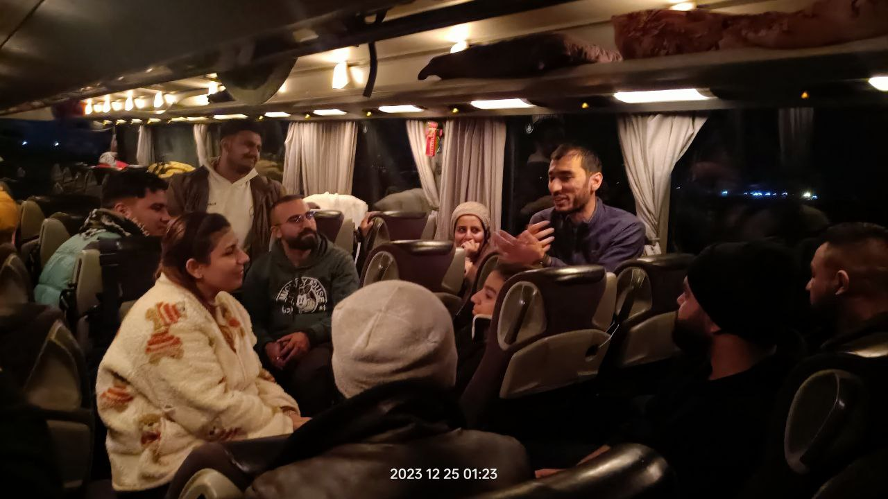
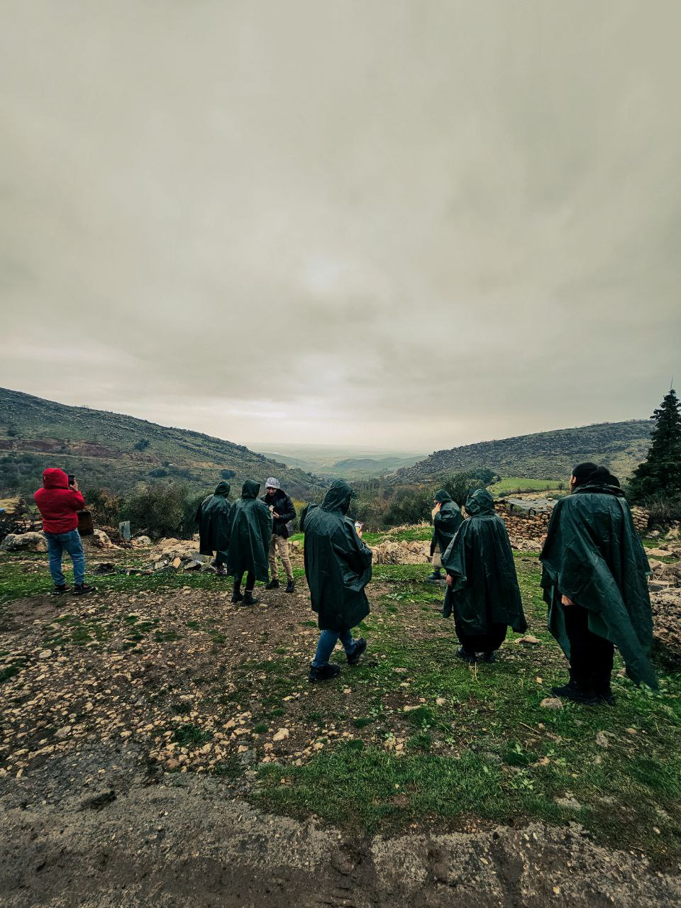
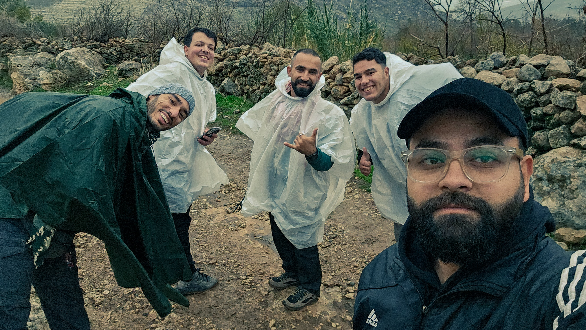
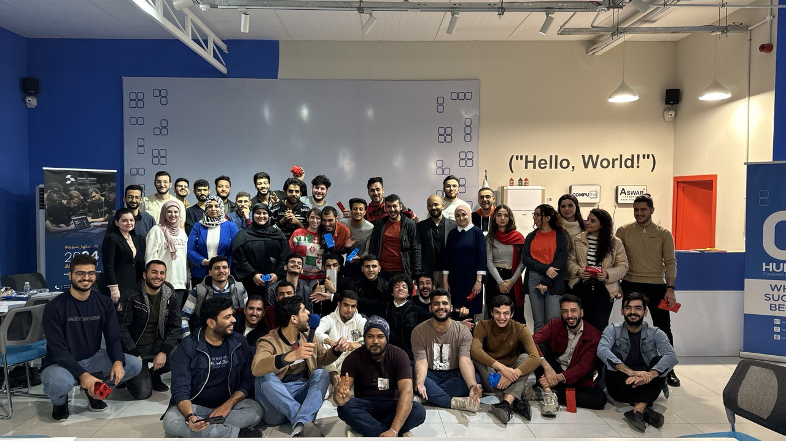
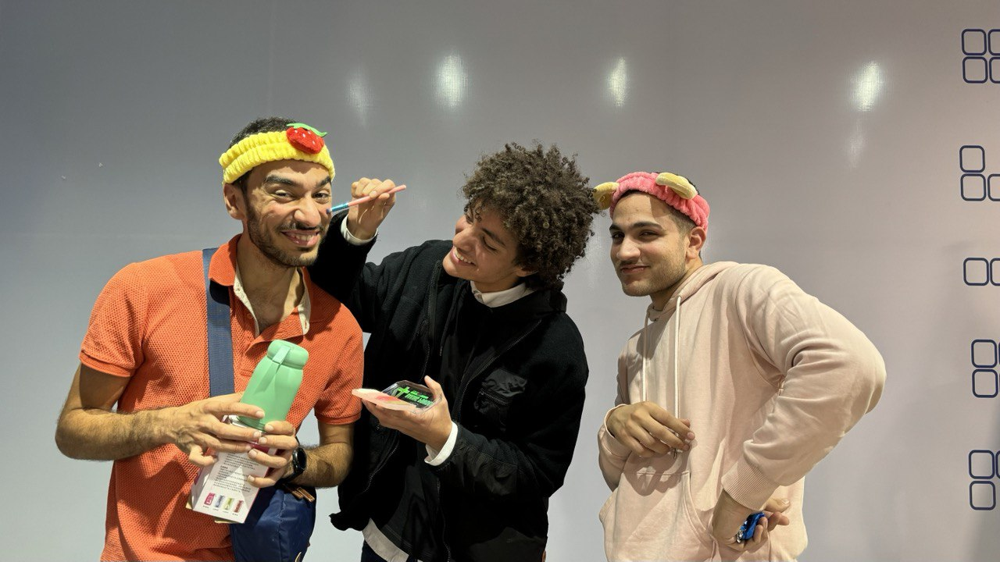
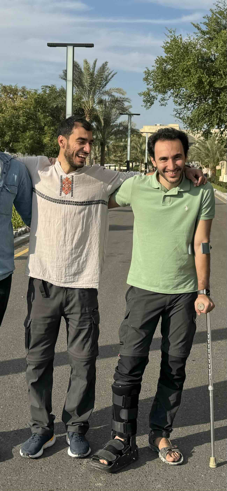

This week was about prioritizing what matters most: being with family, connecting with friends, and spending time in nature.

## Updates

### @Community

- I went on a trip to Akra in the north of Iraq with [Guru Camp](https://www.instagram.com/gurucamp.iq).

    

    On the bus ride back, we exchanged each others’ eyes to view the trip from new perspectives.

    I saw nature that is undisturbed, serene, and gorgeous. We arrived in [Shosh village](http://bot.gov.krd/duhok-province-akre/history-and-heritage/shosh-village), located about 20 minutes from the town of Akra. The sky was foggy, and it was drizzling. We hiked for 30 minutes till we got to an open area where we could camp.

    

    The view from the campsite

    We set up our tents, lit a fire, cooked dinner, and played a conversational game to get to know each other’s thoughts before heading to sleep in our respective tents.

    I awoke in the middle of the night to a water drop on my face. I could hear the sound of the excited rain drops as they landed and leaped off on the tarp above me. The wind was swaying the tent left and right with a strong force. It felt as if nature was having a late-night dance party, and I was tucked in my tent missing out on the fun.

    I quickly realized though that the water had seeped inside, and my pants were starting to get wet. I stretched my hand in the darkness and felt the fibers of my backpack soaked. The party may have found its way into my tent, but I was not gonna give up on my slumber that easily. So I turned my head around, and went back to sleep.

    The night continued on like that; waking up every few minutes to a water drop landing on my face, then sliding my face out of the way of the water and going back to sleep.

    As I got out of the tent with the break of dawn, I realized that my tent was erected on a stream and inside a little pool of water was starting to accumulate. We had two whole days and a night ahead of us, and all my clothes and my tent were drenched, and the clouds didn’t seem to be letting up anytime soon. Ali Adventure, the lead organizer of the trip, came to me looking pensive and asked if I could help him brainstorm ways of salvaging the trip. After a short discussion, Ali decided to try to find us a home in the village to host us for the remainder of the trip. This turned out to be a great decision that made the trip even better than originally planned.

    After 3 hours of packing up our camping gear with freezing hands in the heavy rain, we started hiking back to the village. On the way, we heard the peaceful rippling and trickling of the streams, the gentle flow of water caressing the ground it touches, seeping into the smallest pours, inviting plant seeds to spurt out with life from their underground hibernation. The gentle hum of the water lulled our souls into a calm and meditative state.

    We saw the nameless tombstones of those who walked the earth before us. We took shelter under the canopy of a generous and expansive tree, and wondered what has it seen over the years that it stood there silently. It was a short trail that, with each step, transformed us into different people from the ones who started it. Perhaps we were not too different from that seed underground; the natural elements found their ways into our existance and brought life out.

    

    Upon reaching the village, we decided that we wanted to hike even more, so we visited a 3000-year old synagogue and a water spring. We ended our hike in the rain and cold at the home of the [Mukhtar](https://en.wikipedia.org/wiki/Mukhtar) (chief of the village), where we stayed for the rest of the trip. We were welcomed with heaters to dry our clothes, delicious food to fill our stomachs, and mattresses to rest our bodies. It was the ultimate comfort and hospitality.

    At the Mukhtar’s place, we learned that this little adventure we had is but a faint resemblance of the years of displacement the Kurdish people had to endure during Saddam Hussein’s time; when they had to flee their homes and take shelter in the snowy, rainy, and freezing mountains for years. While camping, hiking, and being washed by the rain in the cold were enjoyable experiences for us, for them it was deadly.

    Peace and love to their souls. I invite you to take a moment of silence to honor them.

    *To be continued …*

- Back in Baghdad, Abubakr hosted an annual reunion for the community of Hub200. It was beautiful. We reflected on our passing year and connected with people who had similar interests as ours.

    

    Mina was the only one wearing an ugly Christmas sweater. Is it a coincidence that she’s in the center of the frame?

    

    Ahmed (center) received from Santa the gift of a makeup set, so he decided to test it on me and Saif 😆

### @Family

- We officially hosted people for the first time in our new place! We decided to fast for a day, Saif, Mina, and I cooked, and we hosted Murtadha and Abubakr for Iftar. We’re looking forward to many more guests to come!

    Please be our guest and fill us with your light.

- Murtadha and I have been spending intimate moments together that are turning into cherished memories. We had a 1-on-1 over falafel through which Murtadha lent me his eyes to show me the way he’s been seeing life as an expat returning to his hometown after many years with his loving wife Mayce, while dealing with a mobility disability. We also spent good times making a video together inviting people to sign up for the computer science course we’ll be teaching at the American University in Baghdad, and doing some projects at Murtadha’s home. I’ll share more pictures in the coming issues of the newsletter.

    

    I love this photo with Murtadha at the American University in Baghdad. What a wonderful gift it is to be living in the same city after all this time!

- We watched the movie [Nyad](https://www.netflix.com/watch/81447231), a woman in her sixties who attempts to swim 164 km (102 mi) in 53 hours from Cuba to Florida. Strongly recommended! It’ll make you believe you can do anything!

## Quotes

### I.

In Iraq, I’m face the question of whether to bargain or not every time I’m buying something. This quote comes to mind and reminds me to be more thoughtful with whom to bargain instead of bargain mindlessly:

> My father taught us never to take advantage of poor farmers when we went to the open market. “If you can afford his produce, buy it, and if you cannot, don’t buy it. But never bargain with a poor farmer, because for you a few dong may not be much, but for him it is enough to support his children.”
>

— [Source](https://www.goodreads.com/en/book/show/1199734): Sister Chan Khong. Learning True Love: Practicing Buddhism in a Time of War (book). A Nun's Journey from Vietnam to France and the History of Thich Nhat Hanh's Buddhist Community.

### II.

I was reminded of those lines from Mary Oliver’s poem in the movie Nyad, and they’ve been ringing in my head constantly ever since. If you’ve got time, I recommend you click the source and read the entire poem.

> Tell me, what is it you plan to do
>
>
> With your one wild and precious life?
>

— [Source](http://www.phys.unm.edu/~tw/fas/yits/archive/oliver_thesummerday.html): Mary Oliver. The Summer Day (poem).

### III.

I read this in [James Clear’s newsletter](https://jamesclear.com/3-2-1/december-14-2023#:~:text=Musician%20and%20entrepreneur,Try%20the%20Difference) and have been discussing it with friends over meals. What do you think of it?

> If you're in doubt about something that's not in your life, try it.
>
>
> Things are so different in practice versus in theory.
>
> The only way to know is to experience it yourself.
>
> ... Err on the side of yes. Try it.
>
> If it was a mistake, at least you’ll know first-hand, instead of always wondering.
>
> ---
>
> If you're in doubt about something that's in your life already, get rid of it.
>
> Not just things, this goes for identities, habits, goals, relationships, technology, and anything else.
>
> Default to not having it, then see how you do without.
>
> ... Err on the side of no. Get rid of it. Start with a clean slate.
>
> If it was a mistake, you'll get it back with a renewed enthusiasm.
>

— *[Source](https://sive.rs/trd): Derek Sivers. When in Doubt, Try the Difference (blog post).*

---

That’s all for now. Please [share with me](https://t.me/mujzuh) your feelings and thoughts on this week’s issue.

Sending you wishes for a merry Christmas, happy Hanukkah, and a splendid new year.

Mujtaba
