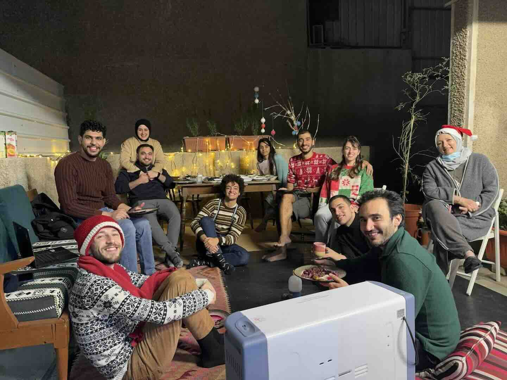
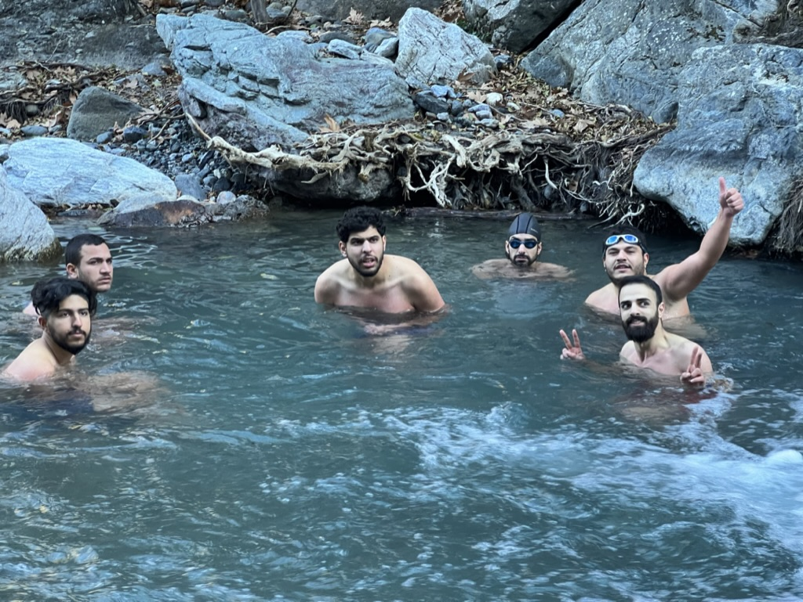
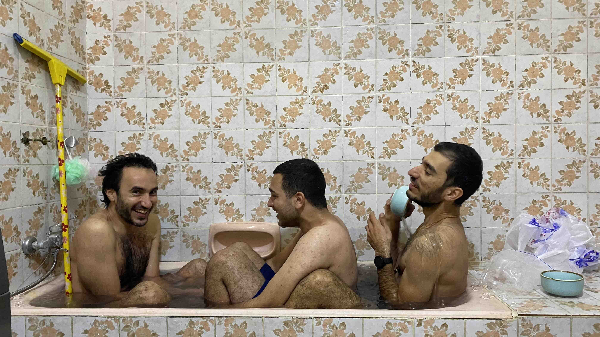
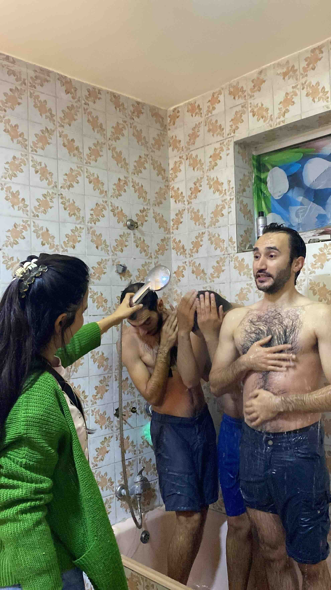
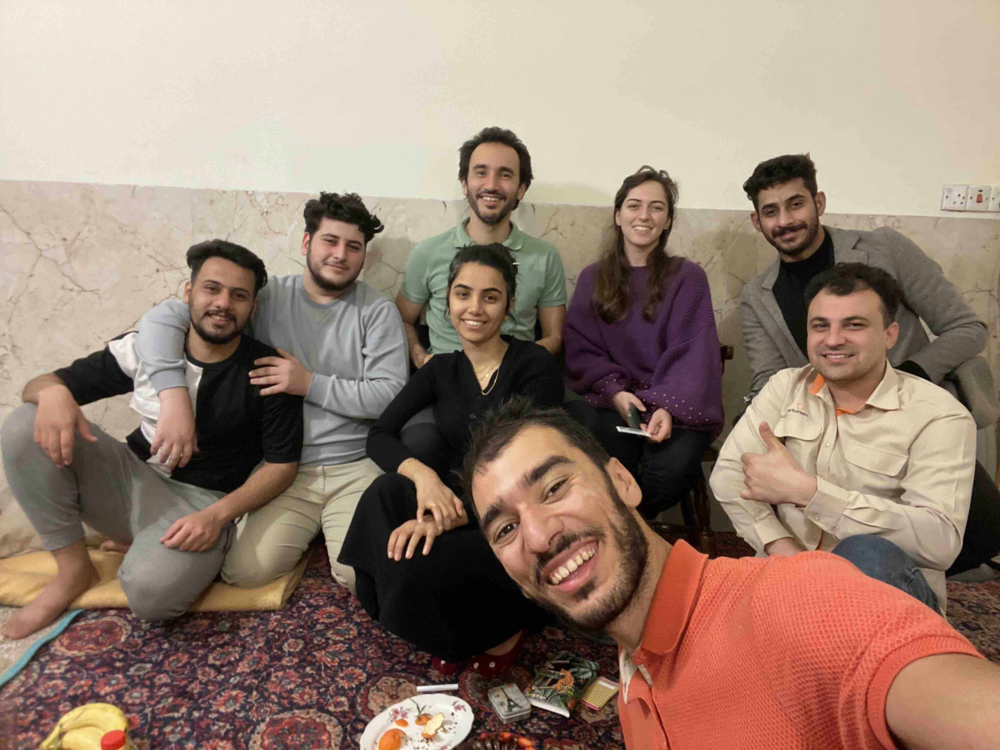
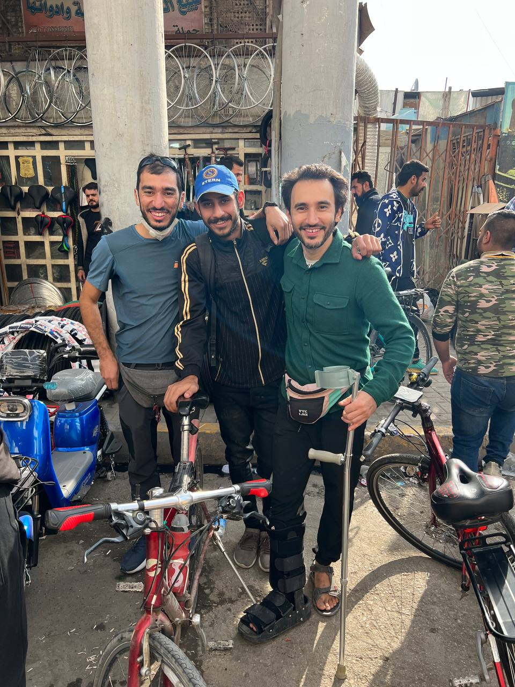

This week was about celebrating the new year with friends and family, cold water exposure, and dealing with big open questions.

## Updates

### @Community

- We hosted a celebration at our new home on New Year’s Eve.

    

    Everybody gathered for our potluck dinner

    Over the past 4 years, the new year’s celebration has been a special event for us, we go out of the city into the mountains or on somebody’s farm, we hold a reunion with our loved ones, disconnect, reflect over the passing year, and do a polar bear plunge/Wim Hof cold exposure. This year was different from that

    

    Dipping in the water at near freezing temperature, 1 year ago. The 3 on the left stayed for 30 minutes!

    This year though, we celebrated as city people and watched the crazy fireworks instead.

    

    The fireworks started before sundown (around 4pm) and went on, non-stop, till 3am, reaching their peak at midnight. Past 3am, it didn’t really stop, it only slowed down a bit. The street was full of people and many of them were lighting up the sky with their fireworks.

    ---

    On New Year’s day, we decided to live up the cold exposure tradition with what we had available to us. We called it, 3 men in a bathtub.

    

    We filled up the tub with water, added 18kg of ice, waited for it to cool down the water, then we all went in at the same time.

    Because our bodies were warming up the water quickly and we wanted to get more of our bodies to freeze, Mayce kept re-cooling down new water in a big bowl and pouring it on us again and again.

    

    The entire 20 minutes of being in the water was pretty much all as shown in the video; blabbering incoherently, shivering, and waiting for Mayce to come and torture us. It was a blast haha.

    We finished it all off with a glorious hot shower, which made us feel the blood going through our veins.

    

    The wait while Mayce is spraying others was excruciating.

    We ended the night feeling most relaxed and slept like babies.

- The next day, Murtadha and Mayce hosted a birthday party for our good friend, Mustafa Al-Arabi.

    

    Mustafa is the one in the top right

    Mina and I got him a polaroid camera, and Murtadha got him a bike.

    

    We spent half a day going through the bike shops, and finally buying a bike from a kid on the street who was there not to sell his bike, but to help sell his friend’s  bike. We liked his bike more than his friend’s, and he agreed to sell it to us. What a stroke of serendipity!

- After the bike shopping, we loaded our bikes on a boat, and went for another cold water dip.

    

    I and Sajjad, the boatman and our friend, dove into the Tigris. It was colder than I expected it to be. It was frigid.

### @Family

- To reflect on last year, we asked the following questions:
    - What are you worried about for 2024?
    - What are you excited for in 2024?
    - What books did you read in 2023?
    - Share a quote, poem, saying, or any piece of wisdom that you learned or used from 2023.
    - Share something you were worried about at the start of 2023. How did it turn out? Was it better or worse than you thought?
    - List 3 events, minimum, from 2023 that made you feel life is beautiful.
        - Similar: Share moments and memories from 2023 that resonate with you.
    - Share a funny story from 2023. If you can’t think of one, share a story of a failure in 2023 instead, and let’s have a laugh about it.
        - Not in the spirit of demeaning, but rather to view life with a “nothing’s serious” spirit.
    - The new year, like moving houses, offers the opportunity to let go of old things or bring them with. What will you bring with you into the new year? What will you leave behind? And what will you donate?

### @Me

- I’ve been using my free time this week to review the notes I took in 2023 to remember my thoughts and to organize them. I felt many emotions as I went over each entry, the most common among them is gratitude for having this record. On the journey through my written thoughts, I recalled lessons that I had forgotten, I relived cherished memories, I saw the change in my thinking between now and back then over some events, and my observing mind got a better understanding of what my thinking mind was doing when it was in control.

    I now feel a strong incentive to keep writing and journaling, and to do it even more.

## Quotes

This week’s quotes will be a bit different. They’ll come from my notes of hangouts with friends and family in 2023. Enjoy.

---

### I.

My good friends Saif Kareem and Ahmed Piano taught me an important lesson about making people feel safe.

Ahmed said this to me after I gave him a call telling him that I didn’t like the way he was communicating with me. I told him everything that bothered me, and did not hold back. After we got through it all, he thanked me for making him feel safe, because he could do anything around me, and I would tell him about it:

> You’ll tell me anything, even if I don’t like it.
>

— Ahmed Piano

Later, I worked with Saif and we also got into a situation that got me to gave him some difficult feedback. He too, said that this made him feel safe and that he felt comfortable to make mistakes with me, because I’d tell him about it when it happens.

### II.


في احد تجمعاتنا بالسنة السابقة، طرح احد الاعضاء السؤال:

“هل الانسان مسير ام مخير؟”

فاقتبس ابوبكر الجواب:

> ان الانسان مخير في ما يعلم، مسير في ما لايعلم.
اي انه يزداد حرية، كلما ازداد علماً.
>

— محمد الغزالي


Translation:

In one of our gatherings last year, somebody asked:

“Do we, humans, have free will, or are we predetermined?”

Abubakr spoke up and quoted:

> Man is free-willed in what he knows, and predetermined in what he doesn’t know.
That is, freedom increases as we learn.
>

— Mohammed Al-Ghazali

### III.

Here’s a funny one I heard from Reem (Mina’s sister) as she was telling Mina to stop being stressed:


> الحاجة الي تخاف تخسرها اخسرها علشان تبطل تخاف.

— احمد حلمي


Translation:

> The thing you’re afraid of losing, just lose it, so you can stop being afraid.

— Ahmed Helmi

🤷🏻 Don’t quote me on the translations, it’s hard to translate beautifully said statements. This is more of an estimation of what the original saying implies.

---

That’s all for now. Please [share with me](https://t.me/mujzuh) your feelings and thoughts on this week’s issue.

Once again, happy and peaceful new year ❤️

Mujtaba
